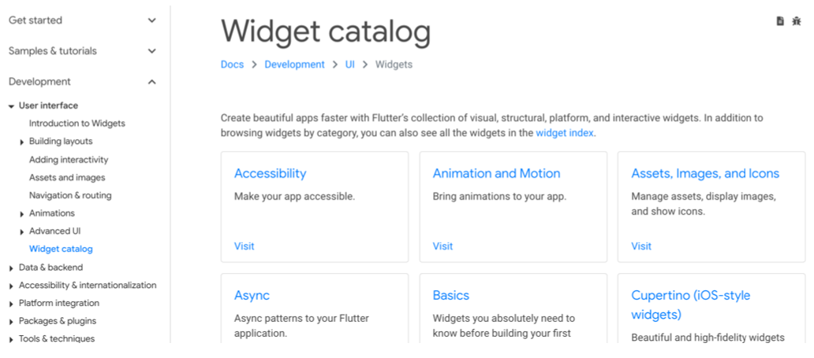
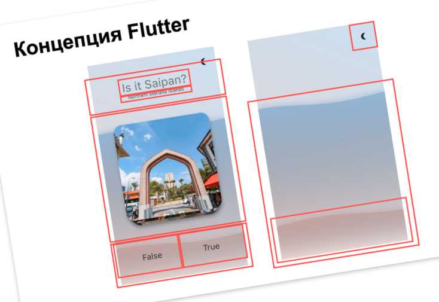
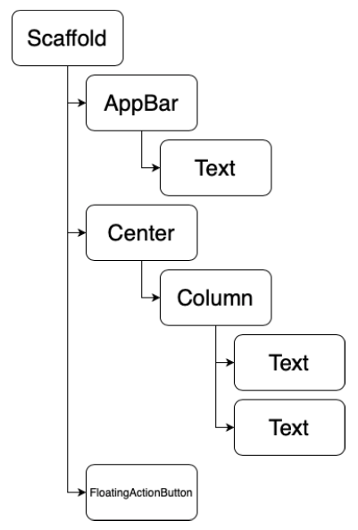
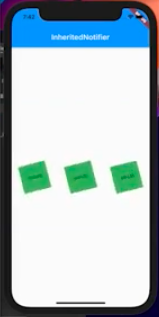

# Flutter 2. Виджеты. Деревья виджетов.

__Зачем это всё нужно?__

* UI во Flutter’е и близко не похож на UIKit/вёрстку в Android (опустим SwiftUI и Jetpack Compose)
* Виджеты бывают разных типов и понимать их возможности критически важно
* Только понимая, как устроен UI под капотом, получится делать сложные интерфейсы
* Flutter из коробки имеет очень удобные инструменты для работы с UI и данными, важно уметь их правильно использовать

__Рассматриваемые вопросы:__

* Что такое виджет
* Какими бывают виджеты
* Из чего состоит сущность на экране

## Виджет, что это такое




__Виджет__ - _это всё, что можно увидеть на экране_.

Более формально, __виджет__ - _это неизменяемая (статичная) конфигурация_.

```java
@immutable
abstract class Widget extends DiagnosticableTree {
  /// Initializes [key] for subclasses.
  const Widget({ this.key });
}
```

Виджеты образуют _дерево_ (или _иерархию_). Древовидная, иерархическая структура.



* При помощи виджетов описывается интерфейс (UI) Flutter-приложения
* Виджеты являются репрезентацией конфигурации какого-то компонента на экране
* Виджеты — высокоуровневые сущности, с которыми мы работаем подавляющую часть времени
* Виджеты — глупые. А вот то, что у них под капотом — поумнее. Они ничего не знают о том, откуда берутся данные, о жизненном цикле своего создания / пересоздания / перерисовок (он его не контролирует) и т.д.

## Какими бывают виджеты

__StatelessWidget__

* Та самая легковесная конфигурация
* Описывает интерфейс (UI), наполняет его данными
* Ничем не управляет, может быть перерисован только “по команде” родителя. Пересоздаётся фреймворком при изменении данных.

__StatefulWidget__ - виджет, который имеет ассоциированный с ним _state_.

* Сам по себе виджет — всё та же легковесная конфигурация, иммутабельная, ничего не может. У неё есть метод `createState()`, который state создаёт (он принимает параметры, чтобы что-то нарисовать или сделать с полученными данными)
* `State` — тяжеловес, может мутировать. Это отдельный класс, экземпляр которого НЕ пересоздаётся при перерисовках (при пересоздании виджета)
* state может управлять своими перерисовками при помощи `setState()`, который триггерит вызов метода `build()`.
* У `State` есть собственный жизненный цикл, на его события можно реагировать

```java
import 'package:flutter/material.dart';

// Стейтфул Виджет, иммутабельный
class MyOwnWidget extends StatefulWidget {
  @override
  _MyOwnWidgetState createState() => _MyOwnWidgetState();
}

// Стейт, мутабельный
class _MyOwnWidgetState extends State<MyOwnWidget> {
  bool _isShapeCircle = true;

  @override
  Widget build(BuildContext context) {
    return Scaffold(
      appBar: AppBar(
        title: Text('Stateful'),
      ),
      body: GestureDetector(
        onTap: () => setState(() => _isShapeCircle = !_isShapeCircle),
        // onTap: () => _isShapeCircle = !_isShapeCircle, 
        // не работает, для перерисовки нужно вызвать setState()
        child: Container(
          decoration: BoxDecoration(
            shape: _isShapeCircle ? BoxShape.circle : BoxShape.rectangle,
            color: _isShapeCircle ? Colors.lime : Colors.lightGreen,
          ),
          alignment: Alignment.center,
          child: Text(
            'Hello, world!',
            textDirection: TextDirection.ltr,
            style: TextStyle(color: Colors.black, fontSize: 40),
          ),
        ),
      ),
    );
  }
}
```

### State Lifecycle

* `initState` — единожды при инициализации, при создании стейта
* `didChangeDependencies` — единожды после инициализации и далее при уведомлениях от виджетов вверху по дереву, от которых этот stateful widget зависит. Например, stateful widget может зависеть от __InheritedWidget__. `StatefulWidget` может зависеть от других виджетов, которые находятся выше по дереву, и если у них меняются данные, то вызывается метод ЖЦ State'а `didChangeDependencies` (если виджет подписан на изменения в предке).
* `didUpdateWidget` — каждый раз при обновлении конфигурации виджета (т.е. при update'e ассоциированного виджета). В него прилетает ссылка на старый виджет, и можно сравнить один виджет с другим и что-нибудь сделать.
* `setState` — вызывается императивно для перерисовки, чтобы вызвался `build()`
* `build` — каждый раз при перерисовке
* `dispose` — при удалении state и statefulwidget из дерева. В этом методе можно сделать очистку, если в стейте есть какие-то подписки на стримы или что-то похожее.

Ещё есть флаг `mounted`, он выставляется в true перед `initState()` и в false перед `dispose()`. Флаг показывает, был ли вставлен стейт в иерархию элементов (что такое элемент, пойдет речь далее).

Как работать со стейтом?

```java
import 'package:flutter/material.dart';

class StatefulLifecycle extends StatefulWidget {
  final String text;

  const StatefulLifecycle({Key? key, required this.text}) : super(key: key);

  @override
  _StatefulLifecycleState createState() => _StatefulLifecycleState();
}

class _StatefulLifecycleState extends State<StatefulLifecycle> {
  late bool _isShapeCircle;

  // отрабатывает первым; до вызова build(). 
  // В этот момент у нас еще нет первого кадра.
  // Это важно, потому что есть переменная `late bool _isShapeCircle;`,
  // которая далее используется в методе build(). 
  // она сеттится в initState(), и всё работает хорошо.
  // если ее не засеттить таким образом, то крэш.
  // Сеттить данные в initState() - это нормальная практика.
  // Заметим, что в initState() нет доступа к контексту. Стейт еще не встроен в дерево
  // элементов, в иерархию, которая отрисовывается.
  @override
  void initState() {
    super.initState();
    print('initState');
    _isShapeCircle = false;
    // print(MediaQuery.of(context).size); // Обратиться к контексту здесь неправильно
    // Обратиться к InheritedWidget'y (это некоторый виджет, который можно получить из
    // контекста, который находится выше по дереву) не получиться, потому по контекст
    // еще не проинициализирован.
    // Раскомментирование принта приведет к крэшу.

    // Первый кадр может быть нужен для того, чтобы узнать размер виджета, нарисованного
    // на экране. До момента отрисовки это узнать нельзя. На первом кадре виджет спросил у
    // родителя, какие размеры у него, и как отрисоваться самому. Ребенок отрисовывается
    // на основании данных родителя.
    // Если мы хотим обратиться к чему-то, что известно только после первой отрисовки,
    // в initState(), у нас есть 
    // (Это клей м/у слоем виджетов и flutter engine).
    WidgetsBinding.instance?.addPostFrameCallback((timestamp) {
      // Здесь уже первая отрисовка была выполнена.
      // Можно получить из контекста виджет и его размер.
      // Но такой подход - "неочень". Только если без этого совсем никуда.
      // Напр., если нужно завязаться на размеры системной клавиатуры, сдвинуть ячейки 
      // таблицы, что-то такое - тогда полезно знать, что такое есть.
      // Чтобы допилить какой-то костыль, хак (без него не работает, с ним работает),
      // В целом такие практики нам не очень нужны.
    });
  }

  @override
  void didChangeDependencies() {
    super.didChangeDependencies();
    print('didChangeDependencies');
    // print(MediaQuery.of(context).size); // Здесь это отработало бы нормально
  }

  // Здесь можно сравнивать старый и новый виджеты.
  @override
  void didUpdateWidget(StatefulLifecycle oldWidget) {
    super.didUpdateWidget(oldWidget);
    // widget - ссылка на виджет
    print('didUpdateWidget, was: ${oldWidget.text}, now: ${widget.text}');
  }

  @override
  void dispose() {
    super.dispose();
    print('dispose');
  }

  @override
  Widget build(BuildContext context) {
    print('build');
    return Scaffold(
      appBar: AppBar(
        title: Text('State Lifecycle'),
      ),
      body: GestureDetector(
        onTap: () => setState(() => _isShapeCircle = !_isShapeCircle),
        child: Container(
          decoration: BoxDecoration(
            shape: _isShapeCircle ? BoxShape.circle : BoxShape.rectangle,
            color: _isShapeCircle ? Colors.lime : Colors.lightGreen,
          ),
          alignment: Alignment.center,
          child: Text(
            widget.text,
            textDirection: TextDirection.ltr,
            style: TextStyle(color: Colors.black, fontSize: 40),
          ),
        ),
      ),
    );
  }
}
```

При этом в консоль будет выведено:

```
initState
didChangeDependencies
build
didUpdateWidget, was: Hello, world!, now: Hello, world! 
build
```

__InheritedWidget__

Особый тип виджета, "прокси-виджет" `ProxyWidget`.

* Предоставляет данные, ничего не рисует на экране. У него нет "рисовалки".
* Решает проблему передачи данных через конструкторы — сильно расцепляет и упрощает код
* Может быть доступен для виджетов внизу по дереву через контекст при обращении методом `dependOnInheritedWidgetOfExactType<T>(BuildContext context)`
* Может уведомлять виджеты внизу по дереву об изменениях в собственных данных, тем самым провоцируя их перерисовку

В чем проблема передачи данных через конструкторы?

```java
import 'package:flutter/material.dart';

// корневой виджет с тайтлом
class RootLevelWidget extends StatelessWidget {
  final String title;

  const RootLevelWidget({Key? key, required this.title}) : super(key: key);

  @override
  Widget build(BuildContext context) => Scaffold(
        appBar: AppBar(title: Text('Many Levels')),
        body: SecondLevelWidget( // вложенный виджет, рисующий этот тайтл
          title: this.title,
        ),
      );
}

class SecondLevelWidget extends StatelessWidget {
  final String title;

  const SecondLevelWidget({Key? key, required this.title}) : super(key: key);

  // В него вложен третий виджет с этим тайтлом
  @override
  Widget build(BuildContext context) => HelloWorldDecorationWidget(
        title: this.title,
      );
}

class HelloWorldDecorationWidget extends StatelessWidget {
  final String title;

  const HelloWorldDecorationWidget({Key? key, required this.title})
      : super(key: key);

  @override
  Widget build(BuildContext context) => Container(
        decoration: BoxDecoration(shape: BoxShape.circle, color: Colors.orange),
        alignment: Alignment.center,
        child: HelloWorldTitleOnlyWidget(
          title: title,
        ),
      );
}

// И четвертый виджет, уже отвечающий за отрисовку тайтла
class HelloWorldTitleOnlyWidget extends StatelessWidget {
  final String title;

  HelloWorldTitleOnlyWidget({Key? key, required this.title}) : super(key: key);

  @override
  Widget build(BuildContext context) => Text(
        title,
        textDirection: TextDirection.ltr,
        style: TextStyle(color: Colors.black, fontSize: 40),
      );
}

// В итоге тайтл пробрасывался через три уровня, хотя он нужен только внизу.
```

Как `InheritedWidget` ее решает?

```java
class TitleProvider extends InheritedWidget {
  final String title;
  final Widget child; // это дочерний виджет, который отрисовывается и нужен для 
                      // работы с иерархией виджетов.
  // Здесь мб что-угодно, любые данные, DTO etc.

  TitleProvider({
    required this.title,
    required this.child,
  }) : super(child: child);

  // Возвращает флаг, должен ли фреймворк уведомлять наши виджеты, которые
  // зависят от InheritedWidget'a. Вспоминаем метод ЖЦ didChangeDependencies()
  @override
  bool updateShouldNotify(InheritedWidget oldWidget) => true;

  // Общепринятый "сахар", как упростить обращение к InheritedWidget'y
  static TitleProvider? of(BuildContext context) =>
      context.dependOnInheritedWidgetOfExactType<TitleProvider>();
}

class IneritedRootLevelWidget extends StatelessWidget {
  @override
  Widget build(BuildContext context) => Scaffold(
        appBar: AppBar(
          title: Text('InheritedWidget'),
        ),
        body: SecondLevelWidget(),
      );
}

class SecondLevelWidget extends StatelessWidget {
  @override
  Widget build(BuildContext context) => HelloWorldDecorationWidget();
}

class HelloWorldDecorationWidget extends StatelessWidget {
  @override
  Widget build(BuildContext context) => Container(
        decoration: BoxDecoration(
          shape: BoxShape.circle,
          color: Colors.blueGrey,
        ),
        alignment: Alignment.center,
        child: HelloWorldTitleOnlyWidget(),
      );
}

class HelloWorldTitleOnlyWidget extends StatelessWidget {
  @override
  Widget build(BuildContext context) {
    // У Флаттера есть набор встроенных "из-коробки" InheritedWidget'ов, напр, MediaQuery
    // он содержит данные о размере экрана. MediaQuery находится внутри MaterialApp,
    // без MaterialApp'a его нет.
    final size = MediaQuery.of(context).size;

    // Обращение к нужным данным, которые могут находиться сильно выше по дереву.
    // Без протаскивания параметров вниз на 5 уровней.
    final title =
        '${TitleProvider.of(context)?.title ?? 'broken data'}\nSize: ${size.toString()}';

    print(size);

    return Text(
      title,
      textDirection: TextDirection.ltr,
      textAlign: TextAlign.center,
      style: TextStyle(color: Colors.black, fontSize: 40),
    );
  }
}
```

Корневой виджет этого примера:

```java
class MyApp extends StatelessWidget {
  // ...
  Widget _getExample(Example example) {
    // ...
    case Example.inherited:
        return TitleProvider(
          title: 'Hello, world!',
          child: IneritedRootLevelWidget(),
        );
  }
} 
```

__Flutter DevTools__ позволяет увидеть всю иерархию наших виджетов.

Популярный кейс использования InheritedWidget'ов - это _темы_. Например, мы можем сформировать палитру цветов для светлой темы, темной темы. Держать в InheritedWidget'е значение текущей темы (light or dark), и всю палитру, а в виджете обращаться к `Theme.of(context)?.backgroundColor`. Во Флаттере в MaterialApp есть ThemeData из коробки. Это самый простой способ реализовать работу с темами во флаттере.

### Inherited notifier

Пример: три вращающихся зеленых квадратика.

Inherited notifier похож на InheritedWidget, плюс он из коробки позволяет работать с ValueListenable. Это некий объект, который может предоставляють value, у которого есть метод notifyListeners. Позволяет оповещать не один, а несколько объектов.



```java
class InheritedNotifierExample extends StatefulWidget {
  InheritedNotifierExample({Key? key}) : super(key: key);

  @override
  _InheritedNotifierExampleState createState() =>
      _InheritedNotifierExampleState();
}

class _InheritedNotifierExampleState extends State<InheritedNotifierExample>
    with TickerProviderStateMixin {
  late AnimationController _controller;

  // Виджет, в котором есть контроллер для анимаций.
  @override
  void initState() {
    super.initState();
    _controller = AnimationController(
      duration: const Duration(seconds: 10),
      vsync: this,
    )..repeat();
  }

  @override
  void dispose() {
    _controller.dispose();
    super.dispose();
  }

  // Нужно уведомлять каждый из квадратиков о том, что некоторое значение обновилось
  // Для каждого build() значение изменяется по чуть-чуть
  @override
  Widget build(BuildContext context) {
    print('InheritedNotifierExample build');
    return Scaffold(
      appBar: AppBar(
        title: Text('InheritedNotifier'),
      ),
      body: Center(
        child: SpinModel(
          notifier: _controller,
          child: Row(
            mainAxisAlignment: MainAxisAlignment.spaceAround,
            children: const <Widget>[
              Spinner(), // можно было бы передать animContrlr.value в параметр спиннеру
              Spinner(), // но вместо это можно использовать Inherited notifier
              Spinner(),
            ],
          ),
        ),
      ),
    );
  }
}

// Модель с нотифаером:
// AnimationController - это нотифаер, потому что
// AnimationController -> Animation<double> -> Listenable -> ValueListenable. 
class SpinModel extends InheritedNotifier<AnimationController> {
  SpinModel({
    Key? key,
    required AnimationController notifier,
    required Widget child,
  }) : super(
          key: key,
          notifier: notifier,
          child: child,
        );

  // Метод получения значения в анимации:
  static double? of(BuildContext context) {
    return context
        .dependOnInheritedWidgetOfExactType<SpinModel>()
        ?.notifier
        ?.value;
  }
}

class Spinner extends StatelessWidget {
  const Spinner();

  // Здесь задается анимация исходя из полученного value из модели.
  @override
  Widget build(BuildContext context) {
    final value = SpinModel.of(context) ?? 0;

    return Transform.rotate(
      angle: value * 2.0 * math.pi,
      child: Container(
        width: 75,
        height: 75,
        color: Colors.green,
        child: const Center(
          child: Text('Whee!'),
        ),
      ),
    );
  }
}
```

Inherited notifier также можно использовать для сравнительно простенького _state management_. Он находится вверху иерархии виджетов, в него можно положить полезные данные, которые могут обновляться при поступлении ответов от бэкенда. Например, чат, приходят новые сообщения, окно чата может смотреть на этот нотифаер, который уведомляет всех слушателей о приходе нового сообщения. И происходит перерисовка окна чата с новыми данными.
