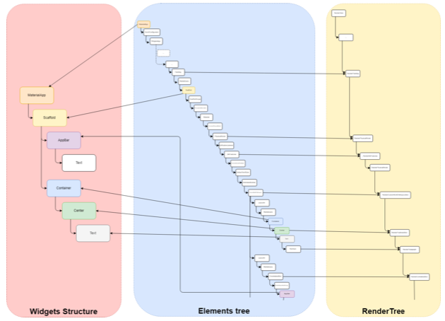
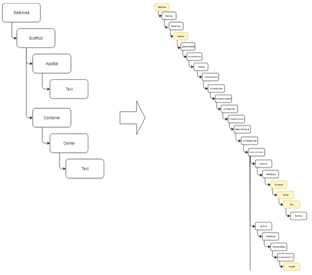
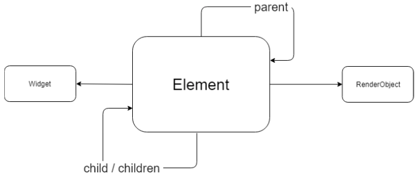
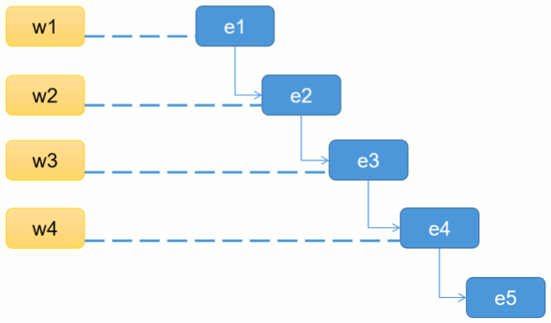
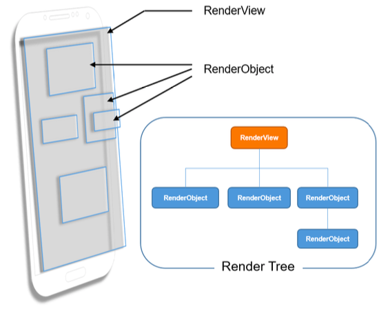

# Flutter 2. Деревья виджетов.

## Из чего состоят виджеты?

Здесь есть разделение ответственности:

* _Виджет_ — легковесная иммутабельная конфигурация, его жизнь ничего не стоит
* _Element_ — нечто, стоящее за виджетом; тяжеловес, мутабельный, ассоциирует конфигурацию с _RenderObject_’ом, который мы уже видим на экране. Элемент - это "сердце" рендеринга в Флаттере. Он знает и о виджете, и о RenderObject'e. Именно элементы образуют дерево.
* _RenderObject_ — сущность, отвечающая непосредственно за отрисовку [виджета]. Именно он знает о размерах получившейся view, именно он её рисовал; он владеет констрейнтами. Во флаттере всё под капотом на констрейнтах. Получает размеры от parent render object. 

Весь __UI во Flutter__ образует __дерево__

* Дерева виджетов _не существует_
* Дерево __элементов__ отражает истинную картину происходящего на экране. Потому что именно у элементов есть ссылки на чайлдов и пэрентов. У RenderObject есть ссылка на parent'a.
* __Дерево рендеринга__ строится на основе __дерева элементов__

Элемент может иметь или не иметь _RenderObject_; если он есть, то происходит отрисовка на экране.



* Виджет — матрёшка, внутри него может быть множество других виджетов
* Каждому виджету соответствует один Element
* Все элементы связаны друг с другом и образуют дерево



* Element имеет ссылку на виджет, который он сам создал, и на RenderObject
* Для перерисовки чего-либо нужно инвалидировать Element через `setState` или
уведомление `proxyElement`. Происходит задание `needsLayout`, инвалидация элемента. Фреймворк знает, что элемент "грязный", его нужно перерисовать.

Именно элементы создают виджет.



Фреймворк на следующей итерации движка рендеринга, на следующем кадре обходит все элементы, на грязных элементах вызывает rebuild(). Он создает новый виджет и обновляет чайлда. Два случая: 1 можно обновить чайлда, 2 виджет стал другим, чайлда нельзя обновить.  Тогда он убирается из иерархии, создается новый элемент и он маунтится.



RenderObject - это то, что рисуется на экране. Это классическая вью на экране. Вью тоже формируют дерево. Оно отображает объекты на канвасе.

* Дерево рендеринга — отражает объекты, появляющиеся на канвасе
* Дерево рендеринга не хранит никакого состояния и никак не заботится о себе, не работает с ЖЦ
* Каждый отдельный RenderObject — глуп



__RenderObject__

* RenderObject изменяемый
* При необходимости перерисовки он также помечается как dirty
* Нуждающийся в перерисовке renderObject перерисовывается, используя свой метод layer
* Именно renderObject слушает нажатия по экрану и обрабатывает их

Рассказ про то, как Flutter Engine обрабатывает тапы на экране. Получает event с координатами точки тапа, renderObject'ы, какой из них может обработать, через него выход на виджет с обработчиком тапа.

Рассказ про работу с UI в DevTools. Из widget'a можно там посмотреть renderObject. Можно, например, посмотреть размер представления `RichText`.

### А что BuildContext?

* `BuildContext`— всего лишь интерфейс, который имплементирует `Element`
* `BuildContext` — это и есть `Element`, а точнее ссылка на него, соответствующая виджету
* Из `BuildContext` можно получить ссылку на `RenderObject` виджета, получить размеры `RenderObject`, обратиться к дереву (через метод `.of`)

Пример того, как делать неправильно:

```java
class MyOwnWidget extends StatelessWidget {
  @override
  Widget build(BuildContext context) {
    return Scaffold(
      appBar: AppBar(
        title: Text('Stateful'),
      ),
      body: GestureDetector(
        onTap: () {
          print('update');
          (context as Element).markNeedsBuild(); // здесь ДИЧЬ
        },
        child: Container(
          decoration: BoxDecoration(
            shape: BoxShape.circle,
            color: Colors.lime,
          ),
          alignment: Alignment.center,
          child: Text(
            'Hello, world! ${Random().nextInt(100)}',
            textDirection: TextDirection.ltr,
            style: TextStyle(color: Colors.black, fontSize: 40),
          ),
        ),
      ),
    );
  }
}
```
