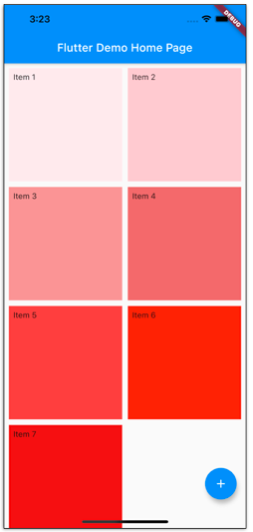

# Flutter. Списки.

Во флаттере есть разные способы работы со списками.

## Основные варианты списков

* `ListView`
* Виджет `Column` (который находится внутри `SingleChildScrollView`)
* `GridView` - списки типа "сетка из ячеек".
* `CustomScrollView` (slivers)

## ListView

Есть разные способы создания списков через `ListView`:

* Статический (для списка из небольшого количества элементов).
* Builder
* Separated
* Custom

### Статический ListView.

Статический скролящийся список из виджетов

```dart
children: List<Widget>
```

Для небольшого количества элементов, так как:

* создаются все элементы (не только видимые),
* все элементы занимают память.

Код примера статического `ListView`:

```dart
class _MyHomePageState extends State<MyHomePage> {

  // ...

  @override
  Widget build(BuildContext context) {
    return Scaffold(
      appBar: AppBar(
        title: Text(widget.title),
      ),
      body: ListView(
        children: <Widget>[
          ListTile(
            title: Text('Item 1'),
            subtitle: Text('subtitle'),
            leading: Icon(Icons.radio_button_on),
            onTap: () => showDialog(
              context: context,
              builder: (_) => AlertDialog(
                title: Text('Title'),
                actions: [
                  TextButton(
                    child: Text('OK'),
                    onPressed: () => Navigator.of(context).pop(),
                  )
                ],
              ),
            ),
          ),
          ListTile(
            title: Text('Item 2'),
            subtitle: Text('subtitle'),
          ),
          ListTile(
            title: Text('Item 3'),
            subtitle: Text('subtitle'),
            trailing: Icon(Icons.arrow_forward),
          ),
          ListTile(
            title: Text('Item 4'),
            leading: Icon(Icons.print),
          ),
          ListTile(
            title: Text('Item 5'),
            subtitle: Text('subtitle'),
          ),
          ListTile(
            title: Text('Item 6'),
            subtitle: Text('subtitle'),
          ),
        ],
      ),
      floatingActionButton: FloatingActionButton(/* ... */),
    );
  }
}
```

`ListTile` могут быть разными, это видно.

### ListView.builder

Это уже динамический список. Builder вызывается для тех элементов, которые появляются. При исчезновении уничтожаются. Называется _lazy construction_.

Полезные свойства:

* `itemBuilder` - задает функцию, которая принимает контекст и индекс, и возвращает элемент (`ListTile`).
* `itemCount` - необязательный (для `ListView.builder`). Главное – чтобы было всё хорошо с обращением к элементу массива по индексу.
* `scrollDirection` - вертикаль, горизонталь.
* `reverse`: `false | true` - порядок показа элементов.
* `addAutomaticKeepAlives` - чтобы список сохранялся при переключении между табами.

```dart
class _MyHomePageState extends State<MyHomePage> {
  // ...
  @override
  Widget build(BuildContext context) {
    return Scaffold(
      appBar: AppBar(
        title: Text(widget.title),
      ),
      body: ListView.builder(
        itemBuilder: (context, index) {
          return ListTile(
            title: Text('Item 1'),
            subtitle: Text('subtitle'),
            leading: Icon(Icons.radio_button_on),
            onTap: () => showDialog(
              context: context,
              builder: (_) => AlertDialog(
                title: Text('Title'),
                actions: [
                  TextButton(
                    child: Text('OK'),
                    onPressed: () => Navigator.of(context).pop(),
                  )
                ],
              ),
            ),
          );
        },
        itemCount: 5,
      ),
      floatingActionButton: FloatingActionButton(/* ... */),
    );
  }
}
```

Пример с добавлением и удалением элементов:

```dart
class _MyHomePageState extends State<MyHomePage> {
  List<String> _items = <String>[];

  void _addItem(String item) {
    setState(() {
      _items.add(item);
    });
  }

  void _removeItem(String item) {
    setState(() {
      _items.remove(item);
    });
  }

  @override
  Widget build(BuildContext context) {
    return Scaffold(
      appBar: AppBar(
        title: Text(widget.title),
      ),
      body: ListView.builder(
        itemBuilder: (context, index) {
          return ListTile(
            title: Text(_items[index]), // здесь используется index
            subtitle: index % 2 == 0 ? Text('subtitle') : null,
            leading: Icon(Icons.radio_button_on),
            onTap: () => showDialog(
              context: context,
              builder: (_) => AlertDialog( // более сложный алерт-диалог.
                title: Text('Do you really want to remove this item?'),
                content: Text(_items[index]),
                actions: [
                  TextButton(
                    child: Text('OK'),
                    onPressed: () {
                      _removeItem(_items[index]);
                      Navigator.of(context).pop();
                    },
                  ),
                  TextButton(
                    child: Text('Cancel'),
                    onPressed: () => Navigator.of(context).pop(),
                  )
                ],
              ),
            ),
          );
        },
        itemCount: _items.length,
      ),
      floatingActionButton: FloatingActionButton(
        onPressed: () => _addItem('Item ${_items.length}'),
        tooltip: 'Increment',
        child: Icon(Icons.add),
      ),
    );
  }
}
```

### 3. ListView.separated

То же, что и .builder, но добавляются разделители. У него есть `itemBuilder`, но дополнительно есть

`separatorBuilder` (похож на `itemBuilder`), в нём возвращается виджет, вокруг него также можно крутить логику.

Становится обязательным:

`itemCount`

```dart
class _MyHomePageState extends State<MyHomePage> {
  List<String> _items = <String>[];

  void _addItem(String item) {
    setState(() {
      _items.add(item);
    });
  }

  void _removeItem(String item) {
    setState(() {
      _items.remove(item);
    });
  }

  @override
  Widget build(BuildContext context) {
    return Scaffold(
      appBar: AppBar(
        title: Text(widget.title),
      ),
      body: ListView.separated(
        itemBuilder: (context, index) => ListTile(/*
          ...
        */),
        itemCount: _items.length,
        separatorBuilder: (context, index) => Divider(
          indent: 8, // отступ разделитя от начала
          color: Colors.grey,
        ),
      ),
      floatingActionButton: FloatingActionButton(/* ... */),
    );
  }
}

```

### 4. ListView.custom

Свой кастомный список. На практике встречается редко.

`SliverChildListDelegate` – статический

`SliverChildBuilderDelegate` – с builder’ом

Удобен, если хотим builder вынести в свой класс.

### Поля ListView:

`ScrollPhysics` - то как список будет себя вести при скролле

* `BouncingScrollPhysics` - эффекты при скролле (~ iOS).
* `ClampingScrollPhysics` ~ Android.

* `AlwaysScrollableScrollPhysics` - всегда скроллится.
* `NeverScrollableScrollPhysics` - список никогда не скроллится.

и другие (более специфичные, кастомные). 

`KeepAlive` - чтобы сохранялось состояние элементов, которые пропадают с экрана (например, при переключении табов запоминать offset).

В ListView:

`addAutomaticKeepAlives = true`

Но в свой класс нужно добавить, в своём State классе добавить `AutomaticKeepAliveClientMixin`

```dart
@override
bool get wantKeepAlive => true;
```

## AnimatedList

ListView с анимацией.

Параметры:

`key` – чтобы затем обращаться к `AnimatedList` по этому ключу. Ключ, чтобы можно было достучаться до анимации. Он передаётся в AnimatedList и используется в методах в `itemBuilder`.

```dart
class _MyHomePageState extends State<MyHomePage> {
  final GlobalKey<AnimatedListState> _listKey = GlobalKey<AnimatedListState>();
  List<String> _items = <String>[];

  @override
  Widget build(BuildContext context) {
    return Scaffold(
      appBar: AppBar(
        title: Text(widget.title),
      ),
      body: AnimatedList(
        key: _listKey,
        itemBuilder: (context, index, animation) =>
            _slideItem(context, animation, _items[index]),
        initialItemCount: _items.length,
      ),
      floatingActionButton: FloatingActionButton(
        onPressed: () => _addItem('Item ${_items.length}'),
        tooltip: 'Increment',
        child: Icon(Icons.add),
      ),
    );
  }

  Widget _slideItem(BuildContext context, Animation animation, String item) {
    final index = _items.indexOf(item);
    return SlideTransition(
      position: animation.drive(Tween(
        begin: Offset(-1, 0),
        end: Offset(0, 0),
      )),
      child: ListTile(
        title: Text(item),
        subtitle: index % 2 == 0 ? Text('subtitle') : null,
        leading: Icon(Icons.radio_button_on),
        onTap: () => _promtRemoveItem(item),
      ),
    );
  }

  void _promtRemoveItem(String item) {
    showDialog(
      context: context,
      builder: (_) => AlertDialog(
        title: Text('Do you really want to remove this item?'),
        content: Text(item),
        actions: [
          TextButton(
            child: Text('OK'),
            onPressed: () {
              _removeItem(item);
              Navigator.of(context).pop();
            },
          ),
          TextButton(
            child: Text('Cancel'),
            onPressed: () => Navigator.of(context).pop(),
          )
        ],
      ),
    );
  }

  void _addItem(String item) {
    _listKey.currentState?.insertItem(_items.length);
    setState(() {
      _items.add(item);
    });
  }

  void _removeItem(String item) {
    final index = _items.indexOf(item);
    _listKey.currentState?.removeItem(
        index, (context, animation) => _slideItem(context, animation, item));
    setState(() {
      _items.remove(item);
    });
  }
}
```

Здесь при добавлении элемент анимированно появляется и при удалении анимированно улетает влево.

---

`ScrollNotification`

Оборачиваем наш `ListView` в `NotificationListener<ScrollNotification>`. Это виджет, в который можно обернуть свой компонент и получать оповещения.

В обработчике `onNotification` получаем события.

Это может быть нужно, например, для того, чтобы следить за скроллом списка, и когда он подходит к концу, по какой-то логике подгружать элементы с бэка. Или еще что-то менять на экране. 

__Пример кода:__

```dart
class _MyHomePageState extends State<MyHomePage> {
  List<String> _items = <String>[];
  void _addItem(String item) {
    setState(() {
      _items.add(item);
    });
  }

  void _removeItem(String item) {
    setState(() {
      _items.remove(item);
    });
  }

  @override
  Widget build(BuildContext context) {
    return Scaffold(
      appBar: AppBar(
        title: Text(widget.title),
      ),
      body: NotificationListener<ScrollNotification>( // в дженерике задайте другой тип, если нужно, 
                                                      // напр., обработать начало или конец движения.
        child: ListView.builder(
          itemBuilder: (context, index) {
            return ListTile(
              title: Text(_items[index]),
              subtitle: index % 2 == 0 ? Text('subtitle') : null,
              leading: Icon(Icons.radio_button_on),
              onTap: () => showDialog(
                context: context,
                builder: (_) => AlertDialog(
                  title: Text('Do you really want to remove this item?'),
                  content: Text(_items[index]),
                  actions: [
                    TextButton(
                      child: Text('OK'),
                      onPressed: () {
                        _removeItem(_items[index]);
                        Navigator.of(context).pop();
                      },
                    ),
                    TextButton(
                      child: Text('Cancel'),
                      onPressed: () => Navigator.of(context).pop(),
                    )
                  ],
                ),
              ),
            );
          },
          itemCount: _items.length,
        ),
        onNotification: (scrollNotification) {
          print('[scrollNotification] ${scrollNotification.metrics.pixels}');
          return true;
        },
      ),
      floatingActionButton: FloatingActionButton(
        onPressed: () => _addItem('Item ${_items.length}'),
        tooltip: 'Increment',
        child: Icon(Icons.add),
      ),
    );
  }
}
```

---

`ScrollController`

Это второй подход к той же задаче - отслеживание скролла. Даёт дополнительные возможности.

Допустим, нужно следить за положением оффсета и по текущему значению крутить какую-то кастомную логику, напр. менять размеры элементов, альфу элементов.

1. Создаём его
2. Добавляем listener
3. Передаём его в ListView
4. Вызвать dispose для освобождения контроллера.

Текущее значение offset можно получить из соответствующего поля контроллера.

```dart
class _MyHomePageState extends State<MyHomePage> {
  List<String> _items = <String>[];
  ScrollController? _controller;
  void _addItem(String item) {
    setState(() {
      _items.add(item);
    });
  }

  void _removeItem(String item) {
    setState(() {
      _items.remove(item);
    });
  }

  @override
  void initState() {
    _controller = ScrollController();
    _controller?.addListener(() {
      print('[listener] position: ${_controller?.position}');
    });
    super.initState();
  }

  @override
  void dispose() {
    _controller?.dispose();
    super.dispose();
  }

  @override
  Widget build(BuildContext context) {
    return Scaffold(
      appBar: AppBar(
        title: Text(widget.title),
      ),
      body: ListView.builder(
        controller: _controller,
        itemBuilder: (context, index) {
          return ListTile(
            title: Text(_items[index]),
            subtitle: index % 2 == 0 ? Text('subtitle') : null,
            leading: Icon(Icons.radio_button_on),
            onTap: () => showDialog(
              context: context,
              builder: (_) => AlertDialog(
                title: Text('Do you really want to remove this item?'),
                content: Text(_items[index]),
                actions: [
                  TextButton(
                    child: Text('OK'),
                    onPressed: () {
                      _removeItem(_items[index]);
                      Navigator.of(context).pop();
                    },
                  ),
                  TextButton(
                    child: Text('Cancel'),
                    onPressed: () => Navigator.of(context).pop(),
                  )
                ],
              ),
            ),
          );
        },
        itemCount: _items.length,
      ),
      floatingActionButton: FloatingActionButton(
        onPressed: () => _addItem('Item ${_items.length}'),
        tooltip: 'Increment',
        child: Icon(Icons.add),
      ),
    );
  }
}
```

### Column и SingleChildScrollView

Это тоже способ создания списков.

Для небольшого количества элементов, так как:

* создаются все элементы (не только видимые),
* все элементы занимают память.


Может быть более гибким, чем статический ListView

```dart
SingleChildScrollView( 
  child: Column(
    children: <Widget>[]
  )
)
```

```dart
class _MyHomePageState extends State<MyHomePage> {
  int _counter = 0;
  void _incrementCounter() {
    setState(() {
      _counter++;
    });
  }

  @override
  Widget build(BuildContext context) {
    return Scaffold(
      appBar: AppBar(
        title: Text(widget.title),
      ),
      body: SingleChildScrollView(
        child: Column(
          children: <Widget>[
            ListTile(
              title: Text('Item 1'),
              subtitle: Text('subtitle'),
              leading: Icon(Icons.radio_button_on),
              onTap: () => showDialog(
                context: context,
                builder: (_) => AlertDialog(
                  title: Text('Title'),
                  actions: [
                    TextButton(
                      child: Text('OK'),
                      onPressed: () => Navigator.of(context).pop(),
                    )
                  ],
                ),
              ),
            ),
            ListTile(
              title: Text('Item 2'),
              subtitle: Text('subtitle'),
            ),
            ListTile(
              title: Text('Item 3'),
              subtitle: Text('subtitle'),
              trailing: Icon(Icons.arrow_forward),
            ),
            ListTile(
              title: Text('Item 4'),
              leading: Icon(Icons.print),
            ),
            ListTile(
              title: Text('Item 5'),
              subtitle: Text('subtitle'),
            ),
            ListTile(
              title: Text('Item 6'),
              subtitle: Text('subtitle'),
            ),
            ListTile(
              title: Text('Item 6'),
              subtitle: Text('subtitle'),
            ),
            ListTile(
              title: Text('Item 6'),
              subtitle: Text('subtitle'),
            ),
            ListTile(
              title: Text('Item 6'),
              subtitle: Text('subtitle'),
            ),
            ListTile(
              title: Text('Item 6'),
              subtitle: Text('subtitle'),
            ),
            ListTile(
              title: Text('Item 6'),
              subtitle: Text('subtitle'),
            ),
            ListTile(
              title: Text('Item 6'),
              subtitle: Text('subtitle'),
            ),
            ListTile(
              title: Text('Item 6'),
              subtitle: Text('subtitle'),
            ),
            ListTile(
              title: Text('Item 6'),
              subtitle: Text('subtitle'),
            ),
            ListTile(
              title: Text('Item 6'),
              subtitle: Text('subtitle'),
            ),
          ],
        ),
      ),
      floatingActionButton: FloatingActionButton(
        onPressed: _incrementCounter,
        tooltip: 'Increment',
        child: Icon(Icons.add),
      ),
    );
  }
}
```

### GridView

Сетка из элементов.

Его несколько вариантов:

1) `GridView.count` (тот, у кого есть обязательный параметр `crossAxisCount`)

2) `GridView.extent` (`maxCrossAxisExtent`)

Если задать свойство crossAxisCount = 1, то по виду как ListView

`GridView.builder`

`CustomScrollView` и `SliverGrid`

`addAutomaticKeepAlives`

```dart
class _MyHomePageState extends State<MyHomePage> {
  int _counter = 0;
  void _incrementCounter() {
    setState(() {
      _counter++;
    });
  }

  @override
  Widget build(BuildContext context) {
    return Scaffold(
      appBar: AppBar(
        title: Text(widget.title),
      ),
      body: GridView.count(
        padding: EdgeInsets.all(8),
        crossAxisSpacing: 10,
        mainAxisSpacing: 10,
        crossAxisCount: 2,
        children: <Widget>[
          Container(
            child: Text('Item 1'),
            padding: EdgeInsets.all(8),
            color: Colors.red[50],
          ),
          Container(
            child: Text('Item 2'),
            padding: EdgeInsets.all(8),
            color: Colors.red[100],
          ),
          Container(
            child: Text('Item 3'),
            padding: EdgeInsets.all(8),
            color: Colors.red[200],
          ),
          Container(
            child: Text('Item 4'),
            padding: EdgeInsets.all(8),
            color: Colors.red[300],
          ),
          Container(
            child: Text('Item 5'),
            padding: EdgeInsets.all(8),
            color: Colors.red[400],
          ),
          Container(
            child: Text('Item 6'),
            padding: EdgeInsets.all(8),
            color: Colors.red[500],
          ),
          Container(
            child: Text('Item 7'),
            padding: EdgeInsets.all(8),
            color: Colors.red[600],
          ),
        ],
      ),
      floatingActionButton: FloatingActionButton(
        onPressed: _incrementCounter,
        tooltip: 'Increment',
        child: Icon(Icons.add),
      ),
    );
  }
}
```

Результат:



Вариант с extent:

```dart
      body: GridView.extent(
         padding: EdgeInsets.all(8),
         crossAxisSpacing: 10,
         mainAxisSpacing: 10,
         crossAxisCount: 2,
         maxCrossAxisExtent: 100, // макс размер элемента по crossAxis. (здесь по горизонтали)
         // ...
```

Динамический GridView:

```dart
     body: GridView.builder(
           gridDelegate: const SliverGridDelegateWithFixedCrossAxisCount(
             crossAxisCount: 3, // отвечает за сайзинг элементов, типа gridView crossAxisCount.
           ),
           itemCount: 300,
           itemBuilder: (BuildContext context, int index) { // практически как в ListView
             return Card(
               color: Colors.red,
               child: Center(child: Text('$index')),
             );
           }),
           // ...
```

Вместо `SliverGridDelegateWithFixedCrossAxisCount` есть вариант с максимальным размером по `crossAxisExtent`.

# CustomScrollView

Использует Sliver – скроллируемая область (scrollable area)

```slivers: List<Widget>``` - поле с массивом скроллируемых элементов.

Позволяет:

Соединять разные “сливеры” (в т.ч. `SliverAppBar`).

```dart
class _MyHomePageState extends State<MyHomePage> {
  int _counter = 0;
  void _incrementCounter() {
    setState(() {
      _counter++;
    });
  }

  @override
  Widget build(BuildContext context) {
    return Scaffold(
      body: CustomScrollView(
        slivers: <Widget>[
          const SliverAppBar( // Элемент сверху, которой растягивается и уменьшается при скролле.
            pinned: true,
            expandedHeight: 250.0,
            flexibleSpace: FlexibleSpaceBar(
              title: Text('Demo'),
            ),
          ),
          SliverGrid( // чуть другой GridView
            gridDelegate: const SliverGridDelegateWithMaxCrossAxisExtent(
              maxCrossAxisExtent: 200.0,
              mainAxisSpacing: 10.0,
              crossAxisSpacing: 10.0,
              childAspectRatio: 4.0,
            ),
            delegate: SliverChildBuilderDelegate(
              (BuildContext context, int index) {
                return Container(
                  alignment: Alignment.center,
                  color: Colors.teal[100 * (index % 9)],
                  child: Text('Grid Item $index'),
                );
              },
              childCount: 20,
            ),
          ),
          SliverFixedExtentList(
            itemExtent: 50.0,
            delegate: SliverChildBuilderDelegate(
              (BuildContext context, int index) {
                return Container(
                  alignment: Alignment.center,
                  color: Colors.lightBlue[100 * (index % 9)],
                  child: Text('List Item $index'),
                );
              },
            ),
          ),
        ],
      ),
      floatingActionButton: FloatingActionButton(
        onPressed: _incrementCounter,
        tooltip: 'Increment',
        child: Icon(Icons.add),
      ),
    );
  }
}
```

Результат:


Это практически максимально гибкий вариант для списков-сеток.


