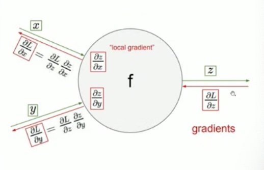

# Введение в Deep Learning

Пример пайплайна нейросети:

```
X --> лин. модель --> нелинейное преобр-е --> логистическая регрессия --> предсказание.
```

## Некоторые общие термины для нейросетей

Преобразования, кот. переносят из __изначальн. призн. пр-ва__ в _промежуточное 1_, _промеж-е 2_ и т.д.

То, что переносит из одного пр-ва в другое, будем называть __слоем__.

Слои бывают линейные `W X + b`

Нелинейные - сигмоида ```sigmoid(h)```.

Input layer, output layer

__Функция активации__ – функция, примененная к аутпуту слоя:

* sigmoid
* tanh
* ...

Функции активации применяются поэлементно – к каждому элементу вектора, матрицы и т. д.

__Backpropagation__ (chain rule)

Нейросеть учится методом взятия производной сложной ф-и == м-д обр. распростр-я ошибки.



Ф. L зависит от выхлопа ф-и z, и для подсчета ∂L/∂x (x - аргумент ф. f) надо посчитать ∂L/∂z ∂z/∂x.

---

– То есть, сначала мы строим новое простр-во признаков, которое нелинейным образом получаем из исходного в несколько шагов, диффер-ем преобразование, а потом обучаемся на новых признаках?

– Примерно так, но не потом, а одновременно. Наше реш-е - посл-сть преобр-й, все из кот-х дифф-емы, и поэтому можно, диффер-я ф-ю потерь по парам-рам предпоследнего, предыдущего, последнего шага и т д, одновременно понять, как их менять, чтобы понизить ф-ю ошибки. И так делаем постепенно, шаг за шагом.

---

Слоёв в NN может быть десятки, сотни и больше.

## Backpropagation

Пример

```
L(w, x) = 1 / {1 + exp[-(x_0 w_0 + x_1 w_1 + w_2)]}
```

Хотим вычислить ```∂L/∂x_0```. Её можно получить при обходе графа вычислений значения L в обратном порядке. (?)

После подсчета производной ф-и потерь по параметру как можно обновить параметр?

```
w_(t+1) = w_t - eta * dL/dw
``` 

eta - learning rate - константа, величина градиентного шага.

С помощью бэкпропа мы считаем производную ф-и потерь по всем параметрам нашей модели. На 1-м слое, на 2-м, на 3-м, на 10-м. А потом, используя эти градиенты, мы обновляем веса, двигаясь по антиградиенту.

---

Обычно векторный вход и векторный выход.

---

## Функции активации

Биологический нейрон как-то активируется.

* Сигмоида

* Гиперболический тангенс

* ReLU

* LeakyReLU

* ELU

Проблема затухающего градиента. 

https://www.youtube.com/watch?v=lK1JumpenyU

