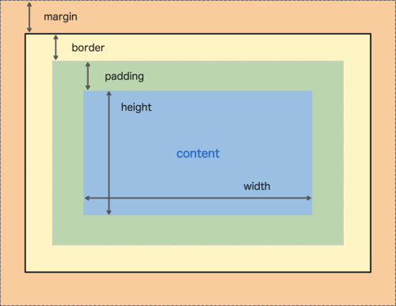

## CSS

### Основы модели визуального форматирования

Элемент --> 1 или несколько прямоугольных блоков (_element boxes_) --> область содержимого.



__Нормальный поток__ - поток элементов, заполняемый так же, как текст (на европейском языке) заполняет страницу.

* __Замещаемый элемент__ - внутри которого жестко зашиты его размеры (содержимое которого замещается чем-то, не содержащемся в самом документе): 
 * ``, `<input>`, `<svg>`
* __Незамещаемые элементы__ – большинство. Их отображаемое агентом пользователя (обычно браузером) содержимое находится внутри генерируемого элементом блока. Пример: `<span>Эй, там!</span>`.
 * __Блочный элемент__ - блоки, идут сверху вниз - `<div>`
 * __Строчный элемент__ (_inline element_) - они идут как символы текста - `<span>`.

В блочных элементах создается разрыв строки перед элементом и после него. В строчных – нет. 

Поля и отступы строчных элементов браузеры обрабатывают по-другому. Посредством установки верхнего или нижнего поля или отступа увеличить высоту строчного элемента не получится. Для строчных элементов `height margin-top margin-bottom` не задаются.

Иногда требуется, чтобы строчные элементы вели себя как блочные, и наоборот. Для этого

```
display: block;
display: inline;
display: inline-block; 
```

---

__Блок-контейнер__:

* Для `<html>` - это viewport. В большинстве браузеров начальный блок-контейнер (блок-контейнер корневого элемента) – это прямоугольник, размер которого соответствует размеру окна просмотра
* Для элементов с `position: static | relative;` - непосредственный родитель. Блок-контейнер формируется краем содержимого ближайшего блочного элемента-предка, ячейки таблицы или строкового блока.
* С `position: absolute;` - ближайший позиционированный родитель (ближайший предок, у которого position != static.  ).

---

__box-sizing__ - свойство, задаёт, что включают в себя свойства `width` и `height` элемента.
* `box-sizing: content-box;` - h и w включают в себя только контент (значение по умолчанию).
* `box-sizing: padding-box;` - включают padding
* `box-sizing: border-box;` - включают border (но не margin).

---

Ширина и высота задают размеры области содержимого для стилизуемого элемента. Фактическая ширина в браузере включает отступы и поля.

Формула для определения ширины блока в нормальном потоке блочных элементов:

```
width-of-containing-block = 
    margin-left + border-left + padding-left + width + padding-right + border-right + margin-right
```

Значения этих величин по умолчанию - ``` (0, 0, 0, auto, 0, 0, 0) ```.

Блочные элементы стремятся заполнить родителя, используя эти значения по умолчанию.

Эта формула должна выполняться всегда. В ней могут отрицательные значения margin --> они могут использоваться для позиционирования дочернего элемента.

Высота блочного элемента определяется высотой потомков в нормальном потоке (в него входят высоты margin, если они не collapse). При этом смежные вертикальные поля "схлопываются", а горизонтальные - нет.

---

```
.d1 {
    // width: 100%; 
	margin-left: -10px;
	margin-right: -50px;
	background: red;
}
```

разное поведение при наличии и отсутствии комментария. Если задать в процентах, то это будет относительно размеров элемента-контейнера.

---

top и bottom для padding и margin, выраженные в процентах, вычисляются относительно ширины. 

---

`direction:` - направление вывода текста.

---

### Границы

Имеют 

1. цвет 
2. толщину 
3. стиль

Скругленные углы

`border-radius: 20px;`

`border-radius: 0 30px 10px 5px;`

Тени

`box-shadow : inset 4px 4px 8px rgba(0,0,0,.75);`

Через `border` можно нарисовать стрелку &#9658;