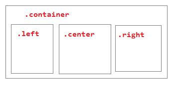

## CSS

### Layouts.

Рассмотрим способы компоновки страницы.



1) __float-based__

```
.left, .center, .right { float: left; }
.container { min-width: 900px; }
.container:after { content: ""; display: table; clear: both; }
.left { width: 20%; }
.center { width: 56%; }
.right { width: 24%; }
```

2) __Раскладка Чикуенка__

Колонки отсчитываются от средней. Удобно для сеток.

3) __Абсолютное позиционирование__

```
.container { position: relative; min-width: 900px; }
.center { min-height: 5em; padding: 0 26% 0 18%; }
.right { position: absolute; right: 0; top: 0; width: 24%; margin-right: 2%; }
.left { position: absolute; left: 0; top: 0; width: 16%; margin-left: 2%; }
```

4) __Абсолютное позиционирование - 2__

5) __inline-block__

```
.container { min-width: 900px; white-space: nowrap; }
.left, .center, .right { display: inline-block; }
```

white-space задается для того, чтобы внутренние строковые элементы не переносились.

6) __Flexbox__

Новая часть стандарта, которая сейчас реализована, видимо, везде.
