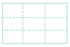

# CSS. Таблицы.



Внутренние элементы <table> генерируют прямоугольники, для кот. нельзя задать поля. 

6 правил организации таблиц 

__"Ячейка сетки"__ - одиночный участок между линиями сетки, на кот. отрисовывается таблица. 

То, на сколько строк или столбцов простирается ячейка, определяется НТМL, а не CSS. 

__Анонимные объекты__

Если в разметке НТМL используются табличные элементы без других, которые должны их охватывать, то охватывающие объекты добавляются как анон. объекты. 

__Слои таблицы__ 

Для сборки представления таблицы определяются б отдельных слоев, е которых размещаются отдельные части таблицы.

1. Слой таблицы 
2. Слой группы столбцов 
3. Слой столбцов 
4. Слой группы строк 
5. Слой строки 
6. Слой ячейки 

Стили каждой части таблицы применяются к отдельным слоям 


__Табличный заголовок <caption>__ 

форматируется как блочный элемент, размещенный перед или после основного блока таблицы. 

```
caption-side: top bottom 
```

__Рамки ячеек таблицы__ 

Модели рамок ячеек таблиц 

Модель отдельных рамок

```
table { border-collapse: separate; } 
```

Модель сливающихся рамок 

```
table { border-collapse: collapse; }
```

Промежуток между рамками ячеек 

задается через свойство `border-spacing: 1рх 5рх;` - горизонтальный промежуток и вертикальный промежуток. Свойство это так же задается для таблицы, а не для отдельных ячеек.

Элементы, свойство display которых имеет значения table или inline-table, не могут иметь отступов, хотя у них могут быть поля. 

Между рамками ячеек нет никаких промежутков и они сливаются. 

Способ слияния рамок зависит от 

* значений свойства border-style, 
* ширины рамки, 
* приоритетности типа элемента с рамкой и его расположения 

__Обработка пустых ячеек__ 

Свойство применяется к ячейкам 

`empty-ce11s: show;` - показывать ячейку с ее границами и фоном; `hide` не показывать.

---

* `display: table` - изобр. эл-т как блочный `<table>` 
* inline-table как строчный `<table>` 
* table-row как `<tr>` 
* table-row-group как `<tbody>`
* table-header-group `<thead>` 
* table-column
* table-column-group
* table-cell
* table-caption 

__Первичность строк__

 Сначала определяются строки, а столбцы задаются производным образом как 1-я, 2-я и др. ячейки строк 

Столбцы и группы столбцов могут принимать только 4 свойства: 

`border border-collapse: collapse`

`background` `width` `visibility: collapse`

 
## Задание размеров таблиц 

### Ширина 

Определение ширины таблицы: 

__Компоновка с фиксированной шириной__

```table-layout: fixed; ```

Компоновка определяется не содержимым, а значениями width таблицы, столбцов и ячеек. 

Ширина определяется по свойствам ширины таблицы, столбцов и ее первой строки 

__Компоновка с автоматической шириной__

```
table-layout: auto; 
```

Компоновка зависит от СОДЕРЖИМОГО, причем ВСЕХ ЯЧЕЕК таблицы (не только первой строки) 

### Высота 

1. Ясное задание высоты посредством свойства height. Тогда это и будет высота таблицы. Размер суммы высот строк может быть больше или меньше этого числа. В CSS2 итоговый эффект от этого задания высоты не определен. 

2. Автоматическая высота таблицы = сумма высот строк, рамок и промежутков. 

### Выравнивание 

Выравнивает содержимое ячейки по горизонтали 

```text-align``` 
 
Вертикальное выравнивание содержимого ячейки 

```vertical-align: top | middle | bottom | baseline ```
