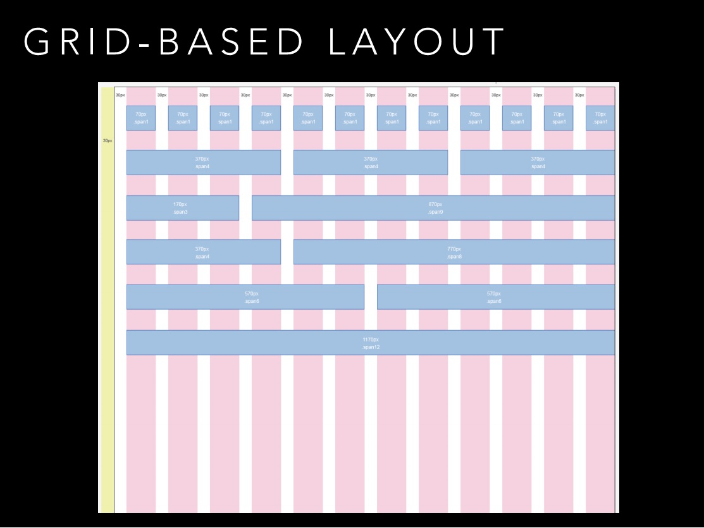

### Адаптивный дизайн

3 характеристики Адаптивного Дизайна:

1. __Медиа-запросы__ - сообщают о разрешении экрана.
2. __Изображения с изменяющимися размерами__ (в зависимости от разрешения экрана). HTML тег `<picture>` предназначен для этого.
3. __Сеточная (grid) компоновка__
