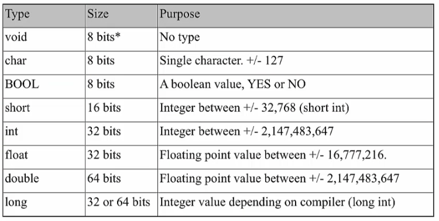
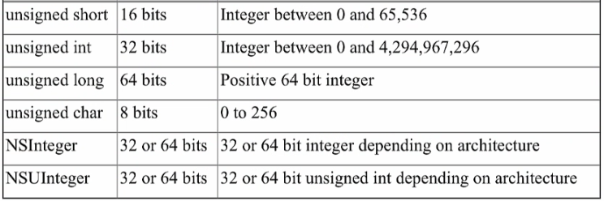
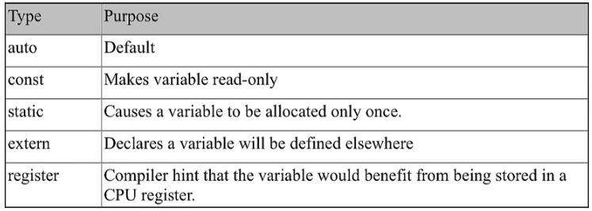
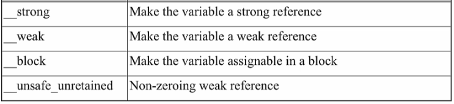
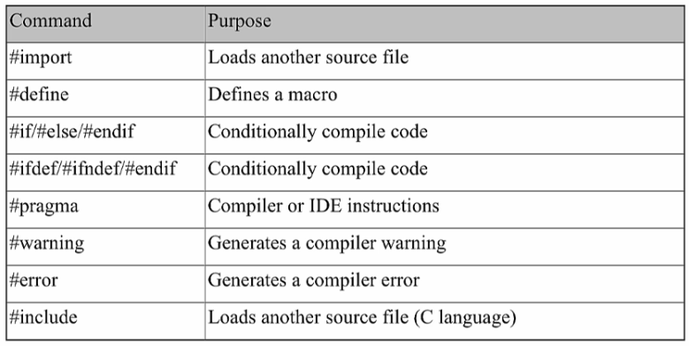

# Objective-C. Базовый синтаксис

## Типы данных

Помимо обычных типов `bool`, `int`, `double` есть также специфические числовые типы для Objective-C...

`@` перед строкой в Objective-C - это сокращение инициализации объекта `NSString`.

Если вы хотите просто работать с некоторым целым типом, то используйте `NSInteger`.

`NSDecimalNumber` - для операций с денежными суммами. Он также позволяет форматировать большие числа, используя заданный разделитель между порядками и   формат может также зависеть от валют.

---

`description` по умолчанию выводит строку о том, к какому типу принадлежит объект и по какому адресу он расположен. 

Его можно переопределить - например, вывести список полей объекта и их значения.

---

Все объекты в Objective-C

* представляются в виде `id`: `id albumListVC = [AlbumListVC new];`
* могут быть проверены на то, к какому классу они принадлежат, через тип `Class`:

```objectivec
Class targetClass = [NSString class];
id mysteryObject = @"An NSString object";
if ([mysteryObject isKindOfClass:targetClass])
{
	NSLog(@"Yup! That's an instance of the target class");
}
``` 

`Class` - это представление того, к какому классу относится объект.

* любому объекту можно послать любое сообщение, используя селектор

```objectivec
SEL someMethod = @selector(sayHello);
```

Тип `SEL` - внутреннее представление имени метода.

Примитивы `id`, `SEL` и `Class` относятся к рантайму, по большей части. Objective-C - динамический язык с поздним связыванием, у него есть своя магия Objective-C Runtime. Они - основная часть, через которую работает рантайм.

Селектор - это строка, являющаяся __ключом__ для поиска __реализации метода__ в __таблице диспетчеризации__. 

```objectivec
SEL someMethod = @selector(sayHello);
```

---

Дженерики в Objective-C были введены для взаимодействия сo Swift.

---

### NSString

Класс, предоставляющий API для работы со строками. `NSString` - неизменяемые строки. `NSMutableString` - подкласс `NSString` для изменяемых строк.

Предоставляет методы 

* сравнения строк,
* поиска в строках,
* модификации строк.

В Objective-C этот класс в принципе можно субклассировать (но нужно ли?).

Создать строку можно

* просто из кода
* из файла
* из содержимого URL


### NSNumber

Класс 

* класс-контейнер для простых типов, например, чтобы хранить их в коллекциях
* для преобразования числовых значений из одного числового типа в другой 
* для сравнения числовых типов на равенство и больше-меньше (на упорядоченность по отношению друг к другу).

### NSDecimalNumber

for representing and performing arithmetic on base-10 numbers.

NSDecimalNumber : NSNumber

An instance can represent any number that can be expressed as mantissa x 10^exponent where mantissa is a decimal integer up to 38 digits long, and exponent is an integer from –128 through 127.

---

Обращайтесь к свойствам -- через точку. 

Вызывайте методы -- через скобки.

---

В Obj-C есть __блоки__ - это что-то типа лямбд.

```objectivec
// ОБХОД МАССИВА С ПОМОЩЬЮ БЛОКА
[germanMakes enumerateObjectsUsingBlock:^(id obj,
                                          NSUInteger idx,
                                          BOOL *stop) {
    NSLog(@"%ld: %@", idx, obj);
}];
```

---

## Hello, World

```objectivec
#import <Foundation/Foundation.h> // импортирует Foundation Framework

int main(int argc, const char * argv[]) {
  
    @autoreleasepool {
		NSLog(@"Hello, World!"); // функция записывает строку в консоль
	}
	
	return 0;
}
```

Результат выполнения:

```
Hello, World!
```

__Basic statement__ - заканчивается точкой с запятой.

__Compound statement__ - в фигурных скобках, задающих __*scope*__. 

autoreleasepool statement - это сompound statement с заданным скобками scope. И блок main-функции - тоже.

---

## Базовые типы Objective-C

__Скалярные типы Objective-C__:





`NSInteger` рекомендуется использовать вместо `long`.

__Модификаторы переменных Objective-C__:



`auto` - автоматическая переменная - обычная локальная или глобальная переменная.

`register` нужен для перформанса; например, можно использовать в некоторых циклах.



Эти 4 модификатора относятся к управлению памятью. 

`sizeof(x)` - функция для определения размера переменной в памяти (количество байт).

`sizeof(NSInteger)` (8 для 64б архитектуры) - ее можно также вызвать для типа.

## Структуры

Это пример типа, для которого можно определить свое имя.

```objectivec
struct MyPoint {
    float x;
	float y;
};

// main
struct MyPoint point;

point.x = 1.1;
point.y = 2.3;
```

Еще пример структуры

```objectivec
struct MyLine {
    struct MyPoint startPoint;
    struct MyPoint endPoint;
};
```

Ключевое слово `typedef` позволяет определить имя, для которого не нужно везде писать `struct`. 

```objectivec
typedef struct {
    float x;
	float y;
} MyPoint;

// main
MyPoint point;

point.x = 1.1;
point.y = 2.3;
```

## Перечисления

Способ 1

```objectivec
enum {
   first = 10,
   second = 100,
   third = 1000
};

typedef NSUInteger MyEnum;

// main
MyEnum x;
```


Способ 2 (>= iOS 6)

```objectivec
typedef enum MyEnum : NSUInteger {
   first = 10,
   second = 100,
   third = 1000
} MyEnum;
```

или

```objectivec
typedef NS_ENUM(NSUInteger, MyEnum)
   first = 10,
   second = 100,
   third = 1000
};
```

## Указатели Objective-C

Одна из самых сложных вещей =)

Указатель - это переменная, содержащая __адрес__ другой переменной.

```objectivec
int y = 7;
int *z = &y; // * - оператор указателя, & - оператор взятия адреса

int p = *z; // * - оператор разыменования
*z = 5;
```

## Преобразование типов

```objectivec
float a = 1.23;
int b = (int) a;
```

## Функции в Objective-C

```objectivec
int factorial(int number) {
    int res = 1;
	
	for(int i = 1; i <= number; ++i) {
	    result = result * i;
	}
	
	return result;
}
```

По умолчанию все передается по значению.

`.m` - обычное расширение для файлов кода на objective-c.

Для выделения функции в отдельный файл нужно определить хедер-файл и m-файл.

```objectivec
// FactorialModule.h

#ifndef Factorial_FactorialModule_h
#define Factorial_FactorialModule_h

extern int int factorial(int number);

#endif
```

потом он импортируется через директиву препроцессора `#import`.

Для локального кода проекта

```objectivec
#import "HeaderFile.h"
```

Для системных фреймворков или сторонних библиотек

```objectivec
#import <HeaderFile.h>
```

Функии Objective-C - такие же как в С. Читайте книги по С, что там сказано про функции.


## Управление потоком программы

### "Fast enumeration"

Это способ обойти коллекцию объектов без манипуляций с переменной индекса.

__Цикл for__

Обычный обход массива строк:

```objectivec
NSArray *array = @[@"First", @"Second", @"Third"];

for (NSInteger n = 0; n < [array count]; n++) {
    NSLog(@"Showing item: %@", array[n]);
}
```

Fast enumeration:

```objectivec
NSArray *array = @[@"First", @"Second", @"Third"];

for (NSString *str in array) {
    NSLog(@"Showing item: %@", str);
}
```


## Использование препроцессора

```objectivec
#define ITERATIONS 10
```

команда препроцессора, которая на этапе работы препроцессора подставит 10 вместо ITERATIONS.



Через проверку значений от препроцессора (из Cocoa Framework) можно проверить во время компиляции, что это программа для iPhone или iPad и многое другое.

---

`NSLog()` напрямую использовать в коде нельзя (из-за нарушения ИБ). В СБОЛе есть своя реализация логирования, которая в том числе позволяет отправить сообщение по электронной почте.

