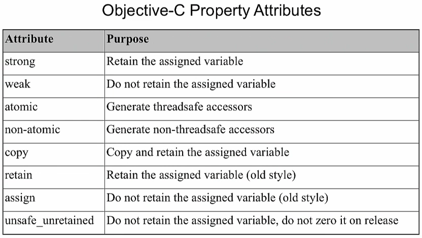

# Objective-C. Классы и объекты.

В Obj-C есть понятие __root class__. Большинство считает, что нельзя создавать свои root class'ы. То есть большинство разработчиков знает, что можно наследоваться от `NSObject` и `NSProxy`.

`NSObject` - это основной класс Obj-C, в котором есть основная реализация объекта как такового. То есть для поддержки работы с объектами класса, нужно обязательно отнаследоваться от `NSObject`.

Что будет, если попробовать создать класс без наследования от `NSObject`? Будет ошибка компиляции, что не указан базовый класс.

Вам могут задать вопрос: сколько root-классов в Objective-C? Простой ответ - 2.

Сложный ответ - неограниченное количество; вы всегда можете объявить свой root-класс, это расширенная возможность языка Objective-C.

---

Класс разбит на 

* `.h`-файл - определяет свойства, методы класса. Определяет наследуемые классы (Интерфейс класса)
 
* `.m`-файл - импортирует данный `.h`-файл. Задает внутреннее поведение, реализацию класса.

Хедер файл компилируется? Лежит в бинарнике? Нет. В бинаре лежит только содержимое файлов имплементации.

__Пример__

```objectivec
// ViewController.h
#import <UIKit/UIKit.h>

@interface ViewController : UIViewController // ViewController - имя класса

@property (weak, nonatomic) IBOutlet UITextView *tweetTextView; // свойство

- (IBAction)postItButtonPressed:(id)sender; // метод

@end
```

```objectivec
// ViewController.m
#import “ViewController.h”
#import “Social/Social.h”

@interface ViewController () // это class extension для определения логики,
    // которая будет только частью файла реализации
    // является пустым в случае отсутствия такой логики
	// задает ПРИВАТНУЮ часть класса (свойства и методы)
@end

@implementation ViewController

... // реализация методов

@end
```

В Objective-C, когда Вы вызываете метод объекта, то используется специальная терминология - "вы отправляете сообщение ему":

`[someObject doSomething]`

Объект - Сообщение

Т.е. здесь метод как сообщение объекту класса.

## Свойства

На интервью про `@property` можно говорить часами.

Свойства обрабатывают создание геттеров и сеттеров. Использование `@property` в хедер-файле указывает компилятору, что мы имеем свойство. В современном Objective-C свойства синтезируются автоматически - вам больше не нужно писать `@synthesize` в файле реализации. В случае синтезированного свойства компилятор сгенерирует геттер, и если это свойство для чтения/записи, и сеттер; и реализует его, основываясь на атрибутах `@property`, объявленных в хедер-файле.

При реализации ARC (_Automatic Reference Counting_), Apple переместила большую часть работы по управлению памятью при разработке для iOS из кода в компилятор. `@synthesize` использовалось для создания переменной в файле реализации раньше. Теперь компилятор делает это за вас.

У свойства есть __атрибуты свойства__ - это очень важная вещь.

При создании свойства (обычно) создаётся переменная экземпляра, хранящая его значение - iVar, instance variable.

Если свойство для `NSString *`, то это будет _указатель_ на строку, а не само значение строки.

Свойство для текстового контрола, содержащего текст твита:

```objectivec
@property (weak, nonatomic) IBOutlet UITextView *tweetTextView;
```

Свойство может быть read-only. Сеттера при этом не будет. Вроде бы это хорошо ложится на принцип инкапсуляции в ООП.

Свойства позволяют одновременно определить поле класса и методы доступа к нему:

`@property (strong, nonatomic) NSString *foo;`

strong - тип ссылки

nonatomic - поведение методов доступа

далее, как обычно - тип и имя.



dot-синтаксис для свойств - это по сути посылка сообщения. Особенность языка Objective-C - что в `nil` можно послать сообщение - приложение от этого не рухнет.

(ObjC) `nil` == `NULL` (Cи). NULL используется для Си-шных штук. `nil` - для Obj-C.

Что будет сгенерировано внутри сеттера-геттера, мы задаём через набор атрибутов.

Хорошая практика при разработке на Objective-C - не обращаться к iVar. Исключение - мб инициализатор, деинициализатор и сеттер.

В ARC свойство по умолчанию - strong.

`atomic` - делает безопасным работу с iVar'ом из разных потоков, выполняет синхронизацию работы потоков. Т.к. это дополнительные затраты при работе, то почти всегда пишут атрибут `nonatomic`.

Смотрели внутри, оказалось, что в `atomic`'е - `SpinLock`. Это такая штука, которая не жрет ресурсы на работу с ядром ОС, а жрет процессор. Один `SpinLock` на сеттер и на геттер. Все потоки, которые хотят прочитать или записать, когда какой-то другой поток захватил `SpinLock`, будут вертеться, пока он не освободится.

`atomic` делает потокобезопасным только чтение и запись указателя. А что находится по этому указателю -- например, словарь `NSMutableDictionary`, остаётся непотокобезопасным. Потокобезопасность работы с ним нужно реализовывать отдельно.

### Атрибут copy

Атрибут `copy` - это штука, которая внутри будет посылать сообщение `copy`. Это нужно для копирования объектов. Сообщение `copy` можно послать объекту, поддерживающему протокол `NSCopying`. Это подходит для, например, `NSString`.

C атрибутом `copy` в сеттере вызовется метод `copy`.

Атрибут `copy` используется для того, чтобы при присвоении свойства засунуть в него копию объекта, который мы хотим присвоить. Это очень хорошо с точки зрения многих аспектов программирования - передавать копию, так как при этом при работе не получиться ничего изменить в исходном объекте.

### Атрибуты nullability

Появились вместе с появлением языка Swift. В Swift есть optional-значения переменных, когда они могут нести реальное значение, а могут содержать `nil`. В Swift более строгая типизация.

Появились эти атрибуты для того, чтобы при использовании Objective-C кода из Swift, было более четко видно, с какими типами Objective-C приходится работать. 

По умолчанию - атрибут `null_unspecified`, который при работе из Swift приводит к force unwrap - а это крэш приложения в случае, если переменная имеет значение `nil`. Чтобы этого не было, нужно правильно задать атрибут nullability из Objective-C.

Если задать свойству атрибут `nonnul`, а потом установить его в `nil`, то получится warning компилятора. Но можно задать правило в проекте, по которому warning'и будут рассматриваться как ошибки.

Если задать `nullable`, то для Swift это будет восприниматься как optional-тип `T?`.

---

В основном по работе с памятью - `strong`.

`weak` - для делегатов и т.п.

`copy` - ... есть интересный кейс про использование атрибута `copy` в мутабельных коллекциях. Например, мутабельный dictionary. Поскольку Objective-C - это динамический язык, нам никто не запрещает сделать плохую вещь. Допустим, у нас есть dictionary у объекта, то никто не запретит присвоить туда mutable dictionary. То есть в одном месте будет изменяемый словарь, а в другом - обычный. Эта проблема решается через атрибут `copy` - тогда при присваивании mutable dictionary в обычный dictionary будет неявно вызван метод `copy`.

То есть основная рекомендация для использования `copy` в Objective-C - использовать его для тех типов, у которых есть мутабельные наследники - `NSString`, `NSArray`, `NSSet`, `NSDictionary` и др. Также есть рекомендация использовать `copy` при работе с __блоками__.  

### Директива @synthesize

В текущей версии языка почти не используется. Обычно 1) для переименования каких-то iVar'ов. 

2) Объявив property в категории, это будет пустышка (?), в этом случае можно использовать `@synthesize`. 

3) В протоколе то же самое - свойство ничего не генерирует, не создаётся instance variable.

Это 3 случая применения директивы `@synthesize`.

### Директива @dynamic

По сути говорит компилятору, что не нужно сейчас генерировать сеттер, геттер и iVar. Что они будут динамическими.

---

Через `self` в `init` к свойству обращаться - это плохо, так как есть дока от Apple, говорящая, что в этом случае могут быть нежелательные side-эффекты. Например, сеттер - это метод. Он может быть переписан (напр., потом, через год). И в результате `init` приведет к другому поведению.

Второе объяснение данного правила - инициализатор выполняет создание объекта, и только по завершению инициализации этим объектом можно пользоваться. А в случае обращения к свойству - ты уже пользуешься объектом через механизмы runtime, до завершения `init`.

Это 2 основные мысли из доки Apple.

---

В Obj-C __единичное наследование__ - это значит, что все объекты классы наследуют от __единичного корневого объекта__, который называется `NSObject`.

Нет множественного наследования в отличие от С++.


## Категории

Зачем нужны? Для расширения интерфейса и реализации любых классов (как своих, так и сторонних, и даже классов iOS SDK).

Если определить метод в классе, и с такой же сигнатурой в категории, и вызвать его -- то вызовется метод категории (!). Чтобы понять это, нужна отдельная лекция про Objective-C runtime, про таблицы диспетчеризации.

Имя категории само по себе нигде, кроме её определения, больше не участвует.

Свойства категорий не имеют хранимого iVar'а.

Категории нужны: а) если длинная цепочка наследования, а надо расширить ее в каком-то срединном классе (?). У наследников этого метода категории не будет.

б) если надо расширить библиотечный класс.

Определение категории может перезаписать метод класса с таким же названием. В Swift эта проблема в основном решена.

Категорий может быть много. Какой метод из них будет вызван - зависит от методов системы `load`, `initialize`.

## Префиксы классов

Apple использует двухбуквенные префиксы

```objectivec
NSString *string = ...;
NSArray *array = ...;
CALayer *layer = ...;
```

Вам следует использовать трехбуквенные префиксы

```objectivec
ABCMyClass *myObj = ...;
```

Как аналог множественного наследования используется такая фишка Obj-C, как __протоколы__.

В Objective-C есть __динамическая типизация__ (__утиная типизация__) -

```objectivec
NSString *foo = [NSString string]; // static typing

id bar = [NString string]; // dynamic typing
```

`id` - специальный тип данных, который позволяет объявить объект любого типа и присвоить его в переменную. Это способ реализации утиной типизации. id говорит, что в переменной может быть любой тип, производный от базового `NSObject`. И тогда при соответствии объекта некоторому вызываемому методу, компилятор будет игнорировать, корректен ли этот тип и просто вызывать его:

```objectivec
id foo = [Duck new];

if ([foo respondsToSelector:@selector(quack)])
    NSLog(@"It's a duck!");
```

## Создание объектов

С объектами в Obj-C работают через указатели.

Инициализация объекта в Obj-C - 2-х шаговый процесс:

Шаг 1 - аллоцирование памяти под объект из класса. 

```objectivec
NSMutableString *myString = [[NSMutableString alloc] init];
[myString appendString:@"Objective-C is cool!"];
```

`[NSMutableString alloc]` - это выделение памяти. Затем возвращаемое значение передается для вызова метода `init`. Это метод делает setup выделенной памяти.

Квадратные скобки в Obj-C указывают на сообщения, которые отправляются классам или объектам. 

`[NSMutableString alloc]` - это отправка сообщения `alloc` в `NSMutableString`. Вся операция в квадратных скобках возвращает некоторое значение.

Способ 2: создание `NSMutableString` через фабричный метод:

```objectivec
NSMutableString *anotherString = [NSMutableString stringWithString:@"Objective-C is cool!"];
```

Это эквивалентно двум строкам из первого способа.

Способ 3: создание объекта строки через литерал строки

Такие литералы есть для `NSString`, `NSArray`, `NSDictionary`. (начиная с iOS 6).

```objectivec
NSString *staticString = @"Objective-C is cool!";

NSArray *anArray = @[@"One", @"Two", @"Three"];
NSDictionary *aDict = @{ @"One": @"A", @"Two": "B"};

NSMutableArray *anMutableArray = @[@"One", @"Two", @"Three"] mutableCopy]; 
// но есть и стандартный инициализатор для NSMutableArray
```

### C-строки vs Objective-C строки

C-строкa - это указатель, не имеет методов

* `"This is C string"`
* `NSLog(@"%s", "This is how you print a C String");`
* `["A C string" length];` // ERROR

Objective-C строка - это объект с методами

* `@"Some string"`
* `NSLog(@"%@", @"How to print string");`
* `[@"Some string" length];` // OK

---

ARC - Automatic Reference Counting - компилятор сам освобождает память объектов, если использовать ARC.

ARC - новая фича; если она не используется, то

```objectivec
[myString release]; // нужно, т.к. был применен alloc
[anArray release]; // т.к. было сделано mutableCopy
```

после работы с этими объектами. Для других вышеизложенных объектов это не нужно - они освобождаются автоматически.

## Объявление классов

Класс млекопитающих.

Опять `.h` - файл и `.m` - файл.

`.h` - ТОЛЬКО публичный интерфейс класса (методы и свойства).

`.m` - включает приватные методы и их реализацию тоже.

```objectivec
// Mammal.h
#import <Foundation/Foundation.h>
#import <Cocoa/Cocoa.h>

@interface Mammal : NSObject // имя класса : имя базовых классов;  
    // NSObject - потому что это самый простой базовый класс

// Свойства 
// свойства имеют атрибуты в скобках ()
// по умолчанию свойства имеют weak-ссылки
@property (strong, nonatomic) NSColor *furColor;
@property (nonatomic) float bodyTemperature;
@property (nonatomic, getter = isHappy) BOOL happy;
@property (weak, nonatomic) Mammal *parent;

// Методы
// "-" означает, что это экземплярный метод
// + означает метод класса (статический метод класса)
// далее - возвращаемое значение
-(void)vocalize;
-(NSArray *)giveLiveBirth;
-(void)nurseYoung:(Mammal *)young; // метод с параметром

// инициализаторы
-(id)init;
-(id)initWithFurColor: (NSColor *)furColor;
-(id)initWithFurColor: (NSColor *)furColor parent:(Mammal *)parent; // это также пример метода 
                                                                    // с несколькими параметрами

+(id)mammal;

@end
```

В классах нужно реализовать метод `init`, потому что в нем производится аллокация и настройка переменных класса (типа конструктор).


Инициализаторы всегда должны иметь `id` возвращаемый тип.

```objectivec
// Mammal.h

#import "Mammal.h"

@interface Mammal ()
-(BOOL)isMyBaby:(Mammal *)young; // методы закрытой части класса
-(void)feed:(Mammal *)young; // также называются "расширением класса"
@end

@implementation Mammal

-(id)init {
    return [self initWithFurColor:[NSColor brownColor]];
}

-(id)initWithFurColor:(NSColor *)furColor {
    return [self initWithFurColor:furColor parent:nil];
}

// инициализатор с самым большим числом параметров являтся базовым для других инициализаторов
// = "designated initializer"
-(id)initWithFurColor:(NSColor *)furColor parent:(Mammal *)parent {
    if ((self = [super init])) { // В init имеется self, и мы вызываем init для супертипа, 
		                         // и присваиваем результат в self - в Obj-C мы обязаны так делать
        // здесь выполнена проверка, что суперкласс не вернул nil из инициализатора, 
		// потому что в ином случае нельзя работать с объектом
	    _furColor = furColor; // для свойства furColor сгенерено экземплярное поле _furColor
		                      // (если не использовано @synthesize)
		_parent = parent;
	}
	
	return self;
}

+(id)mammal { // фабричный метод
    return [[Mammal alloc] init];
}

-(void)vocalize {
    NSLog(@"grunt");
}

-(NSArray *)giveLiveBirth {

}
```

Обычно вся аллокация памяти класса выполняется в designated initializer'e.  

При использовании `@synthesize` символ подчеркивания у переменной поля не будет использоваться. Это старый способ, поэтому без него для совместимости генерируется поле с подчеркиванием.

Использование `Mammal` класса:

```objectivec
#import <Foundation/Foundation.h>
#import <Cocoa/Cocoa.h>
#import "Mammal.h"

int main(int argc, const char * argv[]) {
    @autoreleasepool {
	    Mammal *myMammal = [[Mammal alloc] initWithFurColor:[NSColor blackColor]];
		
		[myMammal setHappy:YES] // по дефолту сеттер имеет префикс set-; геттер просто имеет имя свойства
		myMammal.happy = YES;
		
		NSColor *furColor = myMammal.furColor; // dot-notation для свойства (get- и set-вызовы)
		NSColor *furColor = [myMammal furColor]; // эквивалентно использованию скобок
		
		[myMammal setFurColor:[NSColor blueColor]];
		myMammal.furColor = [NSColor blueColor];
		
		Mammal *myMammal = [Mammal mammal]; // использование классового (статического по сути) метода
	}
	
	return 0;
}
```

## Наследование

Собака наследует от млекопитающего:

```objectivec
// Dog.h
#import "Mammal.h"

@interface Dog : Mammal

-(void)growl;
-(void)bark;

@end

// Dog.m

#import "Dog.h"

@implementation Dog

-(void)vocalize { // переопределяет метод базового класса
    if (self.isHappy) {
	    [self bark];
	} else {
	    [self growl];
	}
}

...

@end
```

Переопределить можно и свойство. 

`[super growl]` - для вызова метода суперкласса.

```objectivec
Mammal *dog = [[Dog alloc] init];
// id dog = [[Dog alloc] init]; - работает аналогично
[dog vocalize];
[dog setHappy:YES];
[dog vocalize];
```

Переобразование типов: `(T*) someValue;` T - тип класса.

`new` в Obj-C - это по сути последовательный вызов `[[SomeClass alloc] init]`.

### Директива @class

Используется для предварительного объявления класса, потому что `#import` сильно воздействует на время компиляции кода проекта.

Но создать экземпляр будет нельзя. Можно 

```objectivec
@class ClassName

...

Class c = [ClassName class];
```

## Протоколы

## @selector

Тип `SEL`.

Динамизм Obj-C заключается в том, что во время выполнения можно создать классы, объекты и вообще всё - это суть механизма runtime. Всё, что нужно писать руками, в Objective-C можно создать кодом.

Класс можно создать из строки.

@selector принимает строку. Написал `viewDidLoad` - при перформСелекторе вызовется viewDidLoad.


## Строки

Компилятор берет все строки и складывает их в одну область памяти.

## Блоки

Блок - это Си-структура на уровне языка (как и Objective-C класс). 

Блок вызывается как функция.

Блок можно именовать, это будет переменная типа блок.

У блока в плане ARC есть счетчик ссылок на него. А также есть указатель на блок...

---

Как сделать стек блок? Передавать его как параметр в метод. Тогда он будет стековым блоком.

Можно передавать блок как параметр типа `id`.

В текущей версии Obj-C почти всегда создается malloc block, создать stack block "очень сложно", это происходит только в особых случаях.

Malloc block создается при захвате какой-то переменной, которая связана с ARC.

Блок захватывает указатели на объекты и увеличивает у них счётчик ссылок.

---

У указателя на константную строку, у класса `[SomeClass class]` счетчик ссылок равен максимальному числу. Потому что они статические в глобальной памяти, и их никогда не надо удалять.

