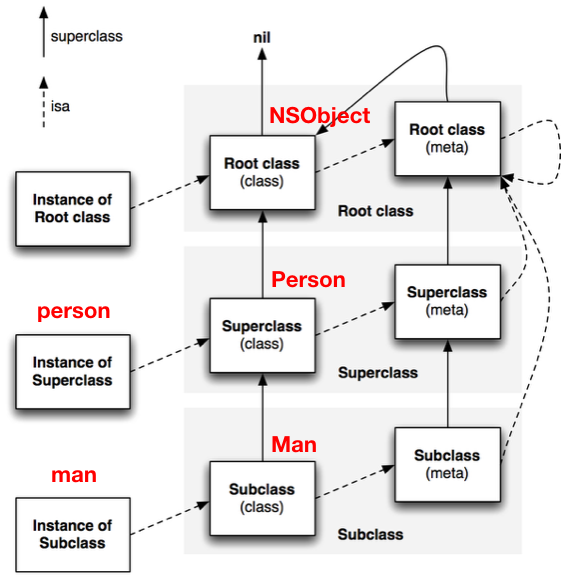

# Objective-C. Runtime

Что такое runtime, из чего он состоит и что такое `NSObject` на продвинутом уровне. 

`NSObject` - __корневой класс__ в системе (для Objective-C). От класса `NSObject` наследуются все остальные объекты.



Еще есть `NSProxy`, но нам он мало интересен.

`NSObject` - это С-структура, в которой есть всего одно поле

```objectivec
struct objc_object {
    Class _Nonnull isa  OBJC_ISA_AVAILABILITY; 
};
```

* `Class` - (тип поля) - это указатель на скрытую в системе структуру `objc_class`, которая скрыта от разработчика и напрямую недоступна, `Class` - это typedef для этой структуры: ```typedef struct objc_class *Class;```
* `_Nonnull` - атрибут nullability
* `isa` - имя поля
* `OBJC_ISA_AVAILABILITY` - некоторый спецификатор компилятора


У каждого объекта, у всех `NSObject` есть `isa` - это "указатель на скрытую в системе структуру `objc_class` ..."

Что такое `Class`:

```objectivec
struct objc_class {
    Class _Nonnull isa  OBJC_ISA_AVAILABILITY;

#if !__OBJC2__
    Class _Nullable super_class /* указатель на суперкласс */OBJC2_UNAVAILABLE;
    const char * _Nonnull name                               OBJC2_UNAVAILABLE;
    long version /* версия (неизвестно зачем) */             OBJC2_UNAVAILABLE;
    long info                                                OBJC2_UNAVAILABLE;
    long instance_size                                       OBJC2_UNAVAILABLE;
    struct objc_ivar_list * _Nullable ivars                  OBJC2_UNAVAILABLE;
    struct objc_method_list * _Nullable * _Nullable methodLists    OBJC2_UNAVAILABLE;
    struct objc_cache * _Nonnull cache                       OBJC2_UNAVAILABLE;
    struct objc_protocol_list * _Nullable protocols          OBJC2_UNAVAILABLE;
#endif

} OBJC2_UNAVAILABLE;
/* Use `Class` instead of `struct objc_class *` */
```

У `Class` тоже есть `isa`, которая тоже указывает на какую-то другую структуру `Class`. Там есть еще одна структура `Class`, которая называется __*метакласс*__ в Objective-C. Метаклассы тоже идут определенным образом и замыкаются. Получается рекурсивное метаклассирование. 

`instance_size` используется при аллокации памяти под объект - определяет сколько памяти выделить.

`objc_ivar_list * ivars` - список iVar'ов. При объявлении iVar'a они записываются в эту структуру. 

Dispatch table в действительности называется `struct objc_method_list * * methodLists` - указатель на указатель типа `objc_method_list`. На самом деле это селектор и реализация (implementation). Здесь получаем двумерный С-массив.  

`struct objc_cache * _Nonnull cache` - штука для ускорения работы Objective-C. Диспетчеризация вызова в Objective-C довольно медленная, и кэш ее ускоряет. Запоминает то, как искалась имплементация. Если цепочка наследования сложная, то после некоторого времени работы программы в кэш попадет актуальная информация для более быстрого нахождения имплементаций. Путь, по которому пойдет посылка сообщения, мы рассмотрим далее.

`struct objc_protocol_list * _Nullable protocols` - список протоколов, которые реализует наш класс. Объекту можно послать сообщение с проверкой, реализует ли он какой-то конкретный протокол. При этом используется данная структура, очевидно. 

## Посылка сообщения

Как известно, делается так:

```objectivec
[self doSomethingWithVar:var1];
```

Реально же она при компиляции трансформируется в системный вызов, это функция для посылки сообщений а Objective-C:

```
objc_msgSend(self, @selector(doSomethingWithVar:), var1);
```

* 1-й аргумент - это объект, которому посылается сообщение.
* 2 - это селектор
* 3, 4, ..., N - это аргументы для метода.

Вот определение этой функции:

```
OBJC_EXPORT id _Nullable
objc_msgSend(id _Nullable self, SEL _Nonnull op, ...)
    OBJC_AVAILABLE(10.0, 2.0, 9.0, 1.0, 2.0);
```
	
Алгоритм, по которому сообщения ищут имплементацию:	
	
Сообщение посылается в структуру `Class` по указателю `isa` в экземпляре (ссылка `self` в данном случае, у нее же есть `isa`). У этой структуры есть таблица методов.

Происходит поиск имплементации в таблице методов: [Selector, Implemetation]

Dispatch table __Таблица диспетчеризации__ = __виртуальная таблица__ = __таблица методов__

1. проверка кэша - если там есть имплементация, то берем ее из кэша и задача выполнена.
2. проверка таблицы методов текущего класса
3. проверка таблицы методов суперкласса

И так до root-класса.

Форвардинг методов (механизм пересылки сообщений, где любой объект в системе может сказать, что он будет реагировать на эту посылку сообщения)

```objectivec
+ (BOOL)instancesRespondToSelector:(SEL)aSelector;
+ (BOOL)conformsToProtocol:(Protocol *)protocol;
- (IMP)methodForSelector:(SEL)aSelector;
+ (IMP)instanceMethodForSelector:(SEL)aSelector;
- (void)doesNotRecognizeSelector:(SEL)aSelector;

- (id)forwardingTargetForSelector:(SEL)aSelector;
- (void)forwardInvocation:(NSInvocation *)anInvocation;
- (NSMethodSignature *)methodSignatureForSelector:(SEL)aSelector;
```

`IMP` - это реализация, которую можно уже вызвать по селектору.

Мы здесь это не рассматриваем, так как вам это вряд ли понадобится, хотя Сбербанк Онлайн это есть.

Что такое вызов функции - у нас есть строгий указатель на эту функцию в скомпилированном коде. В этом отличие посылки сообщения в Objective-C от просто вызова функции.

В Objective-C есть __direct dispatch__ вызова функций (если, например, определить обычную C-функцию). Но есть и динамизм.

```objectivec
Person *person = [Man new];

[person greeting];
```

`isa` в объекте будет показывать на класс `Man`, поэтому не важно, что это указатель на `Person`. Поэтому будет взята имплементация метода для класса `Man`, а не `Person`.

