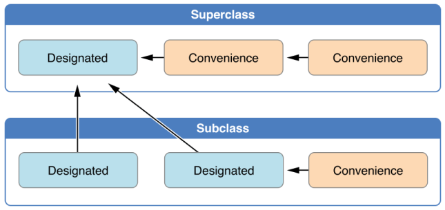
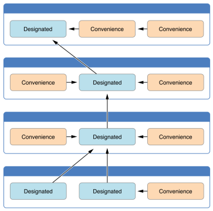
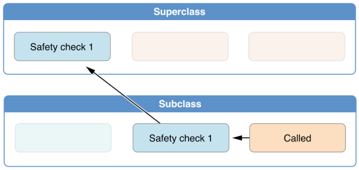
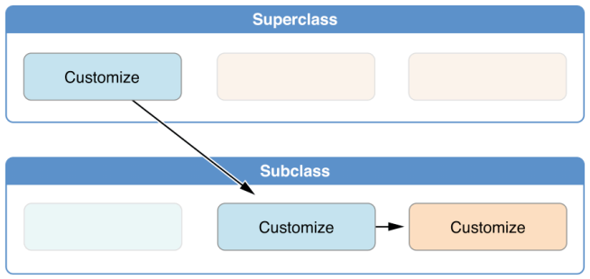

# Swift

Есть кортежи.

```swift
let someTuple = (324, "Some string")

let a = someTuple.0
let str = someTuple.1
```

---

Зачем нужен лейбл для параметра функции?

---

`mutating` - помечает методы __структуры__, изменяющие ее поля.

---

## Ranges

```swift
for i in 1..<10 {

}

for i in 0...10 {

}
```

__*One-sided ranges*__ (односторонние диапазоны):

```swift
let range = str.startIndex...
let range = ..<str.endIndex
```

---

__Конструкция defer__

```swift
func foo() {
  door.open()
  defer {
    door.close()
  }

  // some code...
}
```

## Optionals

Optional в Swift - это либо nil, либо value.

Optional `?` имеет смысл для переменных и констант.
 
Optional (когда есть вопросик) означает "не всегда".

Non-optional - "всегда значение заданного типа".

Optional - это некоторая структура-обёртка над типом:

```swift
var vo: UIView?
var vo1: Optional<UIView> // эквивалентно предыдущей строке
```

Для получения полей используется оператор "?." - это первый способ, для получения значений с проверкой на `nil`.

2-й способ: получение значения без проверки —

```swift
var frx = vo?.frame
var fry = vo!.frame
```

В случае 2: если значение есть, то работа с ним ведётся как с non-optional.

Этот подход называется force-unwrapping для optionals. Если мы не боимся и уверены, что значение в optional'e есть, то можем использовать этот подход. Но это не очень правильный подход, потому что если значения не будет (т. е. оно равно nil), то получим крэш в рантайме. А такое нам не нужно.

Вместо force-unwrap'a используем конструкцию if let, `if let` - это для optional binding. Это не обычный if. Что это вообще такое?

```swift
if let <constantName> = <someOptional> {
	<statements>
}

if let actualNumber = Int(possibleNumber) {
	print("The string \"\(possibleNumer)\" has an integer value of \(actualNumber)")
} else {
	print("The string \"\(possibleNumer)\" could not be converted to integer")
}
```

```swift
if let view1 = view1 {
    // попадем в этот блок только если view1 != nil и внутри него переменная автоматически будет non-optional
}
```

Этот подход лучше. Также можно использовать конструкцию guard let:

```swift
guard let vx1 = view1 else {
    // блок для случая no value
}
```

Она удобна для проверки и разыменования optional-значения на входе в функцию. Это хорошо для реализации golden path / happy path.

## Swift. ООП.

Ключевые слова `class / static` - оба применяются для статических свойств класса. По соглашению `class` - для переменных, `static` - для констант.

Бывают вычислимые свойства:

```swift
class Car {
    ...
	var buyTimestamp: TimeInterval {
		set {...}
		get {...}
	}

	var someGetter: Int { // просто геттер
		return 23;
	}
}
```

Модификаторы доступа в Swift:

* `private(set)` - для свойства только на чтение извне.
* `fileprivate` - внутри файла - public, а для других файлов - `private`.
* `internal` - по умолчанию - открытость в модуле.

В Swift есть деинициализаторы классов:

```swift
class Car {
	deinit {

	}
}
```

(непонятно, зачем они нужны).

## Swift. Управление памятью.

Для этого есть ключевое слово —

`weak` - для пометки ссылок. Нужно для устранения retain-циклов, приводящих к утечкам памяти (см. Obj-C). В Swift это широко используется.

---

## Swift. Структуры

У них есть инициализаторы, генерируемые компилятором 

```swift
struct SomeStruct {
	let name: String
	let something: String
}

let v = SomeStruct(name: "SomeName", something: "SomeString")
```

поля в ините заданы в порядке, в котором объявлены в структуре.

Reference types - классы (живут в куче)

Value types - структуры (живут в стеке)

Еще у структур нет деинициализаторов.

При изменении поля структуры создается новый экземпляр.

Структура - идеальный кандидат для создания иммутабельных DTO (data-transfer object).

Также структуры в силу этого потокобезопасны.

Контракты вообще лучше делать иммутабельными - это спасает от многих ошибок.

---

## Swift. Перечисления

Благодаря ним можно создавать понятные и самодокументированные API.

Имя структуры - можно использовать как имя типа

Элементы перечисления - как значения данного типа.

```swift
let planet = Planets.mars // с маленькой буквы!
```

По умолчанию никакое значение типа int не ставится в соответствие элементу перечисления.

Что такое __raw values__? Для структуры можно дополнительно объявить тип сопоставленного значения (тип raw value для структуры) и сопоставить каждому элементу перечисления значение этого типа.

```swift
p.rawValue // доступ к raw value
```

В элементе также можно иметь хранимые значения:

```swift
// это подходит для написания сетевого слоя
enum Result {
	case success(data: Data, headers: [String: Any])
	case failure(error: Error)
	
	var rawValue: String { // хотим к хранимому значению иметь сырое типа строка
		switch self { 
			case .success return "success"
			case .failure return "failure"
		}
	}
}
```

Сырое и хранимое значение в элементе нельзя иметь одновременно. Но это можно обойти.

Элементы перечисления являются полноценными объектами, для них можно объявлять вычислимые свойства и функции (таким же образом, как для класса/структуры).

Чтобы получить в свое использование хранимые значения элемента перечисления, необходимо воспользоваться оператором switch:

```swift
let res: Result = ..
switch res {
case let .success(data, headers): print(data, headers)
case let .failure(error): print(error)
}
```

---

Расширение в Swift может иметь модификатор доступа. Например, `private extension` будет доступен только в файле, где он задан, а также это сэкономит время компиляции.

---

## Замыкания

```swift
let greetings = { (_ p: String) -> Void in 
	print("Hi \(p)")
}

let greetings: (String) -> Void = { name in
	print("Hi \(name)")
}
```

Если тип захвата внешней переменной не указан, то при использовании она будет захвачена по сильной ссылке.

Явный захват "по значению":

```swift
var printer = Printer()

let sayHello = { [printer] in
	printer.print("Hi")
}

// Захват по слабой ссылке
let sayHello = { [weak printer] in
	printer?.print("Hi") // переменная приводится к optional
}
```

Если вместо weak сделать unowned - это для того случая, когда Вы не хотите приведения к optional, и знаете, что переменная будет жить достаточно долго до момента ее использования. Это может привести к падению в рантайме.

Escaping closure - если надо сохранить замыкание как поле класса или выполнить асинхронный вызов - могут быть вызваны вне scope, в котором объявлены. Здесь есть вопросы управления памятью и работы с потоками. Такие замыкания часто вызываются для т.н. completion handler'ов, функций обратного вызова.

При использовании в классе self'а внутри замыкания можно получить retain-cycle - например, при сохранении замыкания как поля класса. Компилятор не напишет вам предупреждения. Для решения этой проблемы надо захватывать внутри замыкания self по слабой ссылке и проверять на optional.

Non-escaping closure - по умолчанию: вызываются и возвращаются в рамках scope, в котором они объявлены.

---

В Swift функция может иметь несколько возвращаемых значений

---

## Оператор switch

Это объемная тема, switch здесь имеет широкие возможности и применения по сравнению со старыми языками.

Оператор switch в swift позволяет делать pattern matching

```swift

```

Switch не требует break для прерывания. Для аналога поведения как в С++ используется `fallthrough`.

`case`

`case is`

`case let`

`case let as`

`case <диапазон>`

Switch, использующий переопределение оператора `~=`

---

SIL - Swift Intermediate Language

---

## Диспетчеризация методов в Swift

В Objective-C это посылка сообщения, динамическая диспетчеризация.

В Swift, как и Objective-C, есть __direct dispatch__ при вызове функции.

Direct dispatch'a можно добиться и для методов класса, протоколов, расширений при определенных условиях. 

__Witness dispatch__ - берется из протоколов. Witness table представляет протокол, когда он будет загружаться в память по какому-то адресу. 

В нем есть промежуток, он заполняется системными свойствами. (это не важно)

По офсету находится реализация. Офсет есть в объекте. 

В этой схеме нет наследования и полиморфизма - это недостаток witness dispatch. Это как структуры с протоколами.

__Table dispatch__

Тут есть дочерний класс, родительский класс, и за счет переопределения методов мы можем работать с конкретными имплементациями.

---

## Инициализаторы

Инициализатор заполняет поля класса или структуры какими-то значениями.

В Objective-C аллокация и инициализация выполняются отдельно.

Что если у нас иерархия классов.

Для структур нет иерархии, потому что они живут в стеке. 

Есть правила, которые диктуются Apple, о том, как нужно работать с инициализаторами. Мы создали класс, его поля надо инициализировать какими-то значениями. 

Пусть у нас сложная иерархия наследования с разными инициализаторами для разных кейсов. В итоге выделяется 2 типа инициализаторов:

* __convenience__ - вспомогательный инициализатор под конкретный кейс.
* __designated__ - инициализатор, описывающий все значения для конкретного класса. Он не упускает ни одно поле класса. 

Как это использовать при наследовании? Какие инициализаторы должны друг друга вызывать? 

На картинке показано - convenience инициализаторы внутри конкретного класса сводятся к designated-инициализаторам.

Designated-инициализатор класса вызывает designated-инициализатор суперкласса.



Следующая картина показывает то же самое для более сложной иерархии:



Зачем это нужно - потому что в Swift (как и Obj-C) инициализация объектов двухфазная. И у компилятора Swift есть 4 вида чеков, чтобы проверить, что эта инициализация работает корректно.

В чем заключается это двухфазный процесс? 

1-ый этап - идут convenience-инициализаторы, которые сводятся к designated. Каждое поле класса принимает некоторое начальное значение, которое ваш класс ему предоставляет. В Obj-C всем полям назначается 0 или `nil`. В Swift не так, можно написать `let a = 5` - поле сразу получает ненулевое значение, либо поле может получить значение из базового класса. 

После этого идет 2-я фаза, где класс кастомизирует свои значения свойств. 

Вы не можете сначала присвоить свойству значение, а потом вызвать `super`, где это значение поменяется. 4 типа check'ов проверяют это. 

Check 1 проверяет, что все свойства класса проинициализированы до того, как будет вызван `super`. То есть все поля класса должны быть проинициализированы в init'e или им должны быть даны дефолтные значения до `super`.

Check 2: designated инициализатор делегирует установку свойств суперклассу, не переписывая сам заранее наследуемые свойства. Нельзя до обращения к super менять значения наследуемых свойств.

Check 3: convenience инициализатор сначала передает инициализацию свойств другому инициализатору - либо тоже convenience, либо designated'у. И потом инициализирует сам какие-то свойства. Если сделать не так, что компилятор выдаст ошибку.

Check 4: инициализатор не может вызывать методы класса, не может читать значения свойств, он может только проинициализировать их.

В Obj-C то же самое, только там значения по умолчанию 0 или нил всегда.

В Swift если у базового класса инициализатор `init()` не имеет параметров, то его [вызов] можно не писать вообще - компилятор сам его подставит. Если есть всего один designated-инициализатор и без параметров, то компилятор сам его подставляет. 




Если у нас есть класс, у которого свойство А, и подкласс, у которого свойство Б, то при инициализации подкласса сначала инициализируется свойство Б, потом вызываем супер, потом если хотим, даем значение свойству А.

Кастомизировать свойства базовых классов можно тогда, когда вся иерархия суперов размотана и вернула управление в инициализаторе.