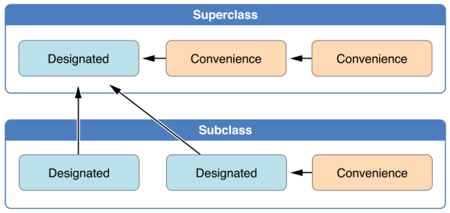
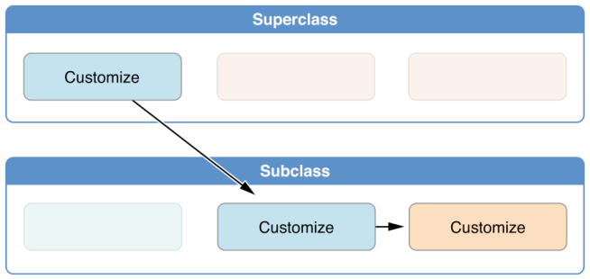

# Swift. Method dispatch.

## Диспетчеризация методов в Swift

Диспетчеризация – это правило, по которому выбирается реализация метода.

В Objective-C это посылка сообщения, динамическая диспетчеризация – __Message Dispatch__.

В свифт есть атрибут `@objc dynamic`, он тоже приводит к Message Dispatch. 

Message Dispatch позволяет делать хакерские вещи, например, подменить реализацию какого-либо метода в рантайм, во время выполнения программы.

### Direct Dispatch

В Swift, как и Objective-C, есть __direct dispatch__ при вызове функции.

Direct Dispatch означает, что при выполнении программы адрес вызываемой функции/метода известен напрямую и сразу.

Это __самый быстрый__ метод диспетчеризации. 

При таком подходе нет полиморфизма и нет наследования.

Direct dispatch'a можно добиться и для методов класса, протоколов, расширений при определенных условиях. 

__Примеры direct dispatch__:

1. Структура или финальный класс, определяющие собственные методы

```swift
struct SomeStruct {
  func foo() { }
}

final class SomeClass {
  func bar() { }
}
```

2. Метод, определяемый в экстеншене протокола и вызываемый по ссылке на тип данного протокола:

```swift
protocol ExtraWorkExecutor {}

extension ExtraWorkExecutor {
  func doExtraWork() {}
}

extension SomeClass: ExtraWorkExecutor {}

let executor: ExtraWorkExecutor = SomeClass()

executor.doExtraWork()
```

3. Метод, определенный в экстеншене класса. Его переопределить нельзя.

4. Приватный метод.

__Table dispatch__

Тут есть дочерний класс, родительский класс, и за счет переопределения методов мы можем работать с конкретными имплементациями.

Table dispatch делится на

* Virtual Table dispatch
* Witness Table dispatch

### Virtual Table dispatch

Относится к наследованию классов. Полиморфизм. Работает медленнее директа.

### Witness Table dispatch

__Witness dispatch__ - берется из протоколов. Witness table создаётся для каждого типа, реализующего протокол и представляет протокол, когда он будет загружаться в память по какому-то адресу. 

В нем есть промежуток, он заполняется системными свойствами. (это не важно)

По офсету находится реализация. Офсет есть в объекте. 

В этой схеме нет наследования - это недостаток witness dispatch. Это для структур с протоколами.

---

## Инициализаторы

Инициализатор заполняет поля класса или структуры какими-то значениями.

В Objective-C аллокация и инициализация выполняются отдельно.

Что если у нас иерархия классов.

Для структур нет иерархии, потому что они живут в стеке. 

Есть правила, которые диктуются Apple, о том, как нужно работать с инициализаторами. Мы создали класс, его поля надо инициализировать какими-то значениями. 

Пусть у нас сложная иерархия наследования с разными инициализаторами для разных кейсов. В итоге выделяется 2 типа инициализаторов:

* __convenience__ - вспомогательный инициализатор под конкретный кейс.
* __designated__ - инициализатор, описывающий все значения для конкретного класса. Он не упускает ни одно поле класса. 

Как это использовать при наследовании? Какие инициализаторы должны друг друга вызывать? 

На картинке показано - convenience инициализаторы внутри конкретного класса сводятся к designated-инициализаторам.

Designated-инициализатор класса вызывает designated-инициализатор суперкласса.



Следующая картина показывает то же самое для более сложной иерархии:


Зачем это нужно - потому что в Swift (как и Obj-C) инициализация объектов двухфазная. И у компилятора Swift есть 4 вида чеков, чтобы проверить, что эта инициализация работает корректно.

В чем заключается это двухфазный процесс? 

1-ый этап - идут convenience-инициализаторы, которые сводятся к designated. Каждое поле класса принимает некоторое начальное значение, которое ваш класс ему предоставляет. В Obj-C всем полям назначается 0 или `nil`. В Swift не так, можно написать `let a = 5` - поле сразу получает ненулевое значение, либо поле может получить значение из базового класса. 

После этого идет 2-я фаза, где класс кастомизирует свои значения свойств. 

Вы не можете сначала присвоить свойству значение, а потом вызвать `super`, где это значение поменяется. 4 типа check'ов проверяют это. 

Check 1 проверяет, что все свойства класса проинициализированы до того, как будет вызван `super`. То есть все поля класса должны быть проинициализированы в init'e или им должны быть даны дефолтные значения до `super`.

Check 2: designated инициализатор делегирует установку свойств суперклассу, не переписывая сам заранее наследуемые свойства. Нельзя до обращения к super менять значения наследуемых свойств.

Check 3: convenience инициализатор сначала передает инициализацию свойств другому инициализатору - либо тоже convenience, либо designated'у. И потом инициализирует сам какие-то свойства. Если сделать не так, что компилятор выдаст ошибку.

Check 4: инициализатор не может вызывать методы класса, не может читать значения свойств, он может только проинициализировать их.

В Obj-C то же самое, только там значения по умолчанию 0 или нил всегда.

В Swift если у базового класса инициализатор `init()` не имеет параметров, то его [вызов] можно не писать вообще - компилятор сам его подставит. Если есть всего один designated-инициализатор и без параметров, то компилятор сам его подставляет. 




Если у нас есть класс, у которого свойство А, и подкласс, у которого свойство Б, то при инициализации подкласса сначала инициализируется свойство Б, потом вызываем супер, потом если хотим, даем значение свойству А.

Кастомизировать свойства базовых классов можно тогда, когда вся иерархия суперов размотана и вернула управление в инициализаторе.