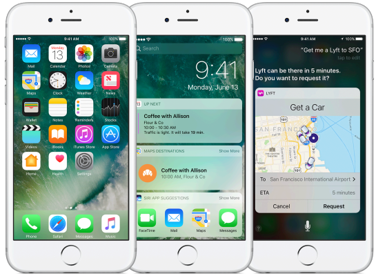
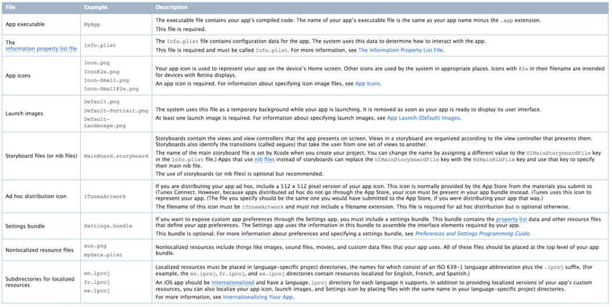

# iOS-Dev.

# Архитектура iOS

## Human Interface Guidelines

HIG (от англ. Human Interface Guidelines) — документ, содержащий рекомендации для разработчиков программного обеспечения. Служит для создания наиболее интуитивных, легкоизучаемых и логичных интерфейсов взаимодействия с пользователями. Как UI, так UX. Обычно унифицирует внешний вид приложений, а также указывает на необходимость использования технологий, позволяющих делать приложение доступным на разных языках и для людей с ограниченными физическими возможностями (слабое зрение/отсутствие зрение) - это делается через Accessibility.

Регламентирует, как ваше приложение вообще должно выглядеть. Как выглядят и ведут себя элементы интерфейса.

Вы сможете в коде создать визуальные компоненты любой сложности и выполняющие любые задачи. Но создав его, окажется, что он никому не нужен. Гайды - лучше использовать стд переключатель. Это не значит, что нужно полностью отказаться от кастомных элементов. 

### Примеры требований HIG

1) Приложение должно иметь launch screen.

2) Контент пуш-уведомления должен быть лаконичным и легко читаемым.

3) Для приложений с IAP кнопка для перехода к IAP должна быть на главном экране приложения на видном месте. 

## Структура iOS-приложения

App Icons - Иконки приложения. Есть не только иконка приложения для его запуска, но 
* Отдельная иконка приложения в системных настройках, 
* отдельная для push-уведомлений.

Launch Images - Изображение, используемое при старте.

Файлы локализации ресурсов.

Файлы storyboard - создавать интерфейсы. В СБОЛ не используется.

## Mac OS и iOS

Во многом они идентичны, отличается Cocoa и Cocoa Touch - это UI-фреймворки для пользовательского взаимодействия. 

Слоистая архитектура iOS на уровне самых верхних слоёв. Можно взаимодействовать напрямую с любым уровнем, но более верхние имеют более простой в использовании API.

Core OS - уровень ядра: работа с файлами, контроль за сертификатами. Интернет-сертификаты, сертификаты безопасности, сертификаты для подписи приложения.

---

# Цикл жизни приложения

5 состояний.

В состоянии Suspended приложение по максимуму выгружает ненужные ресурсы, и перестаёт получать события операционной системы. Из других состояний приложение может получить сообщение `applicationWillTerminate`, а для Suspended его уже не будет, поэтому мы не сможем обработать это событие и сохранить в нём данные.

Приложение в состоянии Suspended может быть убито операционной системой, но при этом оно останется в трейе вместе с другими приложениями. И если по нему тапнуть, то оно перезапустится.

---

# Коммуникация приложений друг с другом

Способы:

1. URL Schemes - в `Info.plist` прописывается url scheme, то есть задаётся строковый идентификатор приложения. И если другое приложение "реализует" этот строковый идентификатор, то ему может быть передано управление с некоторыми параметрами в строке.

2. Activity Controllers - позволяет передавать данные через, например, AirDrop, или напрямую другим приложениям, если они позволяют эти данные принимать.

Взаимодействие между двумя приложениями происходит ограниченным набором средств. __Deeplinks__ - каждое приложение как хост с протоколом, доменным именем и т.д. По такой же схеме реализуются кастомные имена для разных приложений. Из одного можно попасть в другое, передать какие-то данные. Deeplink - это URL c каким-то набором параметров, передаваемых как данные.

Другой способ - шаринг. Можно расшарить информацию между приложениями. Нажимаешь кнопку шаринга, появляется диалоговое окно со списком приложений. То, чем можно поделить -- это ограниченный набор типов, есть спецификация с их списком.

---

`Info.plist` - файл, где хранятся настройки приложения. Если настройку не указать, то будет применена настройка по умолчанию.

---

Asset'ы - это набор JSON-структур.

---

Приложение может быть запущено через deeplink или push-уведомление, и при этом могут быть указаны опции - см. `AppDelegate:application:didFinishLaunchingWithOptions`.

---

`Main.storyboard` - в начальном проекте со сторибордом это начальная точка входа.

---

Способы вместо сторибордов:

1) .xib'ы

2) написание интерфейса в коде.
