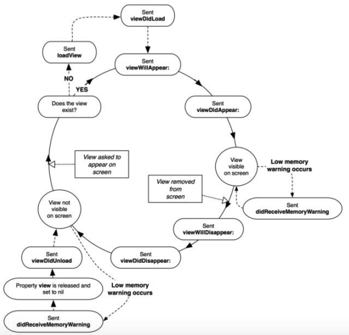

# iOS-Dev.

# UIKit

# MVC

# Жизненный цикл ViewController'a

Базовый класс для контроллеров в iOS-приложениях - `UIViewController`. Является Controller'ом согласно шаблону
проектирования MVC. Обеспечивает взаимосвязь модели и отображения. 

В iOS на него возлагаются
* задачи, связанные с контролем жизненного цикла view, 
* и отображением UIView в различных ориентациях устройства. 

Общую информацию о нём можно найти в той же документации.

Вопрос по жизненному циклу View Controller'a -- зачем он нужен, из каких вызовов состоит, зачем нужны эти вызовы?

## Методы цикла жизни View Controller

__Создание View Controller'a:__

* `init`
* `initWithNibName:`
* `initWithNibName: bundle:`

Для создания контроллера, вернее для его инициализации существует два основных метода — `init` и `initWithNibName:(NSString *)nibNameOrNil`. На самом деле метод `init` вызовет `initWithNibName:`, так что можно рассматривать только его.

Логика метода достаточно проста — мы либо находим `.xib` (`.nib`) файл и ассоциируем его с `UIViewController`'ом, либо не ассоциируем. На данном этапе просто запоминается название xib файла, из которого в случае чего надо подгрузить view.

Расширение .nib - историческое и расшифровывается как "NextSTEP Interface Builder". XIB - xml-представление nib’a.

__Создание View:__

* `(BOOL)isViewLoaded`
* `loadView`
* `viewDidLoad`
* `(UIView*) initWithFrame:(CGRect)frame`
* `(UIView*) initWithCoder:(NSCoder *)coder`

Созданный `UIViewController` может находиться в состоянии «без view» достаточно долго, вплоть до удаления его из памяти. Создание view произойдет только после того, как будет вызван метод `[viewController view]`  (`viewController.view`). Это можете сделать вы, или это может за вас сделать `UINavigationController`, `UITabBarController` и многие другие.

Примером, когда `UIViewController` находится в состоянии «без view», может быть вариант с использованием `UITabBarController`'а, когда изначально он содержит в себе ссылки на N контроллеров, и только у того, который на данный момент показан на экране, будет загружен view. Все остальные контроллеры будут ждать, пока пользователь не переключит таб на них.

После того, как произошел доступ к view, возможны несколько вариантов развития событий:
* вызов переопределенного метода `loadView`
* вызов не переопределенного метода `loadView`,который либо загрузит view из xib файла, либо создаст пустой `UIView`.

И только после этого, наконец-то будет вызван метод `viewDidLoad`.

Метод `viewDidLoad` может быть вызван более одного раза. (???)

Зачем нужен метод `loadView`? У каждого view контроллера есть root view - вьюха, которая отображает как представление. Для того, чтобы изменить этот root view, есть метод `loadView`, в котором эта root view инициализируется. Если не хотим говорить иерархию вью в `viewDidLoad`, то можем задать корневую вьюху в `loadView`.

Root view - это свойство `view` класса `UIViewController`.

```
loadView // This is where subclasses should create their custom view hierarchy if they aren't using a nib.
// Should never be called directly.
```

Можно пройтись по методам ЖЦ View Controller'a в документации и/или через xcode. Там всё подробно описано, ничего не надо придумывать. И так рекомедуется сделать для всех компонентов iOS-приложения, рассмотренных в течение курса.

__Обработка изменения состояния view:__

* `viewDidLoad`


* `viewWillAppear:(BOOL)animated`
* `viewDidAppear:(BOOL)animated` - методы, которые вызываются перед и после появления view на экране. В случае анимации(появление контроллера в модальном окне, или переход в `UINavigationController`'e), `viewWillAppear` будет вызван до анимации, а `viewDidAppear` — после. При вызове `viewWillAppear`, view уже находится в иерархии отображения (view hierarchy) и имеет актуальные размеры, так, что здесь можно производить расчеты, основанные на ширине / высоте view.

* `viewWillDisappear:(BOOL)animated`
* `viewDidDisappear:(BOOL)animated`
* `viewDidUnload`


__Обработка memory warning:__  `didReceiveMemoryWarning`

__Уничтожение:__

* `viewDidUnload` (deprecated)
* `dealloc`



У View Controller'a есть связанная с ним View, понимаемая как представление. В классическом MVC View и Controller раздельны, а в iOS - они находятся в одной связке -- такая особенность.

---

__*Про Interface Builder'ы.*__ Основное состоит в том, что Interface Builder -- это абстракция над UIKit, скрывающая все детали реализации, которые можно делать напрямую в коде. Это ускоряет и упрощает разработку -- можно быстро сделать интерфейс и выпустить приложение. Но более сложные вещи в Interface Builder делать сложнее - например, констрейнты с динамическим расчетом высоты. Нельзя анимированно менять констрейнты -- это можно только в коде. 

Еще минус xib'ов -- они увеличивают время сборки, так как компилируются отдельно. 

При распределенной разработке, где больше одного программиста, становится еще тяжелее. Конфликты, плюс проблемы в работе с визуальным редактором в данном случае.

Если 1 человеку надо быстро создать прототип, то IB - это ОК. Плюс xib'ов также в наличии `IBInspectable` и `IBDesignable` - можно в рантайме менять цвета в настройках.

Если большая команда и промышленная разработка, нужна гибкость при настройке констрейнтов, фреймов и их анимаций, то xib'ы не очень полезны.

Делать ревью xib'ов - нереально. Если в obj-c коде -- то это можно.

У Apple есть глобальная стратегия - снизить порог входа в iOS-разработку за счёт различных инструментов. Swift для этого. But Swift is easy to start, hard to learn. Свифт тут не особо помог.

---

## Как создать интерфейс без Main.storyboard

```objectivec
@implementation AppDelegate


- (BOOL)application:(UIApplication *)application 
                    didFinishLaunchingWithOptions:(NSDictionary *)launchOptions 
{
    // Override point for customization after application launch.
    self.window = [UIWindow new];
    ViewController *rootViewController = [ViewController new];
    
    self.window.rootViewController = rootViewController;
    [self.window makeKeyAndVisible];
    
    return YES;
}

// ...
@end
```

Система построена по принципу владения: 

* `AppDelegate` владеет окном `UIWindow` через свойство `self.window`
* Окно владеет корневым контроллером через свойство `self.window.rootViewController`. Это может быть Navigation Controller, Tab Controller и т. д., который содержит другие контроллеры.


---

# Жесты касания рекогнайзера

UIGestureRecognizer

https://medium.com/yandex-maps-ios/uigesturerecognizer-tutorial-83f2128e479d

---

### Особенности мобильных приложений

Особенность мобильного приложения - оно работает, занимая весь экран для пользователя.

---

### Паттерн MVC в разработке для iOS

В разработке для iOS часто применяется паттерн MVC:

* _View_ - __Component__ (название в iOS-разработке) - компонент есть элемент пользовательского интерфейса (напр., кнопка)

* _Model_ - __DataSource__ - предоставляет данные для приложения

* _Controller_ - __Delegate__ - управляет потоком данных в приложении и тем, какое представление отобразить на экране.

--- 

###  Обработка событий

__Action__ - действие; оно вызывается, например, при нажатии на кнопку.

Чтобы связать поведение и пользовательское действие, в Objective-C __Event__'ы связываются с __IBAction__'ами (IB = Interface Builder). __IBAction__ - это код, который вызывается в ответ на __Event__.

Контрол имеет 1 или более __Event__, запускающихся в ответ на что-то происходящее (типа клика).

__IBOutlet__ - индикатор для свойства класса, который сообщает Interface Builder'у, что оно указывает на UI контрол.

Как написать Action?

У класса есть 2 части - 
* `.h` - файл интерфейса класса (публичные поля и методы класса)
* `.m` - файл реализации класса.

У __*View*__ -> __*View Controller*__. View Controller объект задает программную логику для представления. Он обычно содержит ссылки на контролы, логику обработки их событий, и логику переходов между представлениями экранов.

Нажатие по кнопке (то, что пользователь поднял палец внутри кнопки) называется событием "Touch Up Inside".

Обработка нажатия на кнопку (на которой написано "Post it!"):

```objectivec
#import "ViewController.h"

@interface ViewController ()

@end

@implementation ViewController

- (void)viewDidLoad {
    [super viewDidLoad];
}
- (IBAction)postItButtonPressed:(id)sender {
    NSLog(@"Post It button was pressed!");
}

@end

```

Как получить текст, написанный внутри редактируемого текстового элемента, в методе обработки нажатия на кнопку Post it? Через переменную, ссылающуюся на TextView и запрос текста по этой переменной. Для таких переменных в Objective-C есть конструкция, называемая __*свойством*__. Оно определяется в `.h` файле.

```objectivec
#import <UIKit/UIKit.h>

@interface ViewController : UIViewController
@property (weak, nonatomic) IBOutlet UITextView *tweetTextView;

@end
```

Заметим, что вы присоединяете ваши контролы к аутлетам (см. `IBOutlet`). Аутлет говорит о том, что он указывает на данный `UITextView`. 

Аутлеты ссылаются на что-то в UI. Аутлеты используются для того, чтобы работать с интерфейсом или представлять или получать информацию от пользователя.

`IBAction` - это нажатие на кнопку, а доступ к тексту - через `IBOutlet`. 

После этого можно модифицировать обработку нажатия:

```objectivec
- (IBAction)postItButtonPressed:(id)sender {
    NSLog(@"Post It button was pressed: %@", self.tweetTextView.text);
}
```

---

### UI layout

`*.storyboard` - это XML-файлы, задающие внешний вид экранов приложения и переходы между экранами. `*.xib` - их предыдущее название.

---

### Приложения для смартфонов и планшетов

Приложение для iPhone и iPad = "Universal app"

---

### Фреймворки

iOS 6: появление фреймворков для работы с Twitter и Facebook.

---


