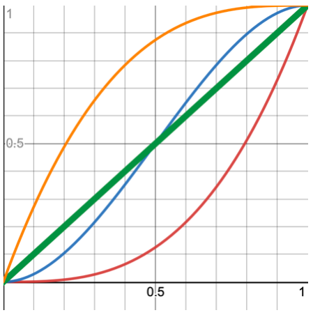
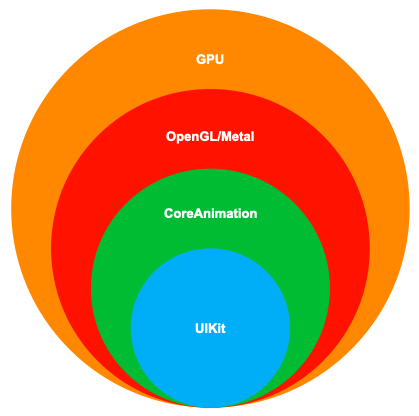
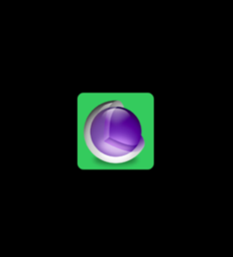
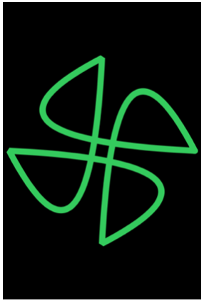
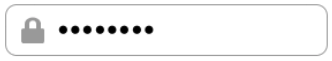
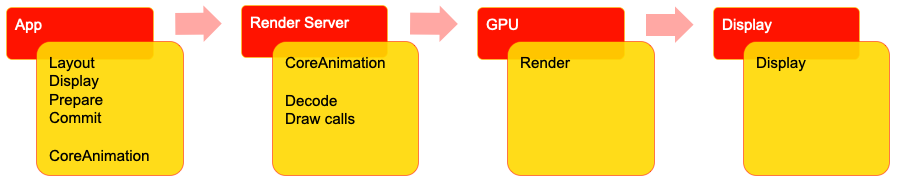
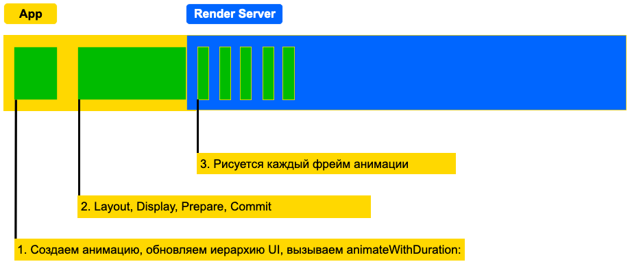

# iOS-Dev. 05. Анимации в iOS

__Что такое анимация?__ 

Анимация – изменение какого-либо значения во времени.

* Размер
* Позиция
* Цвет
* Прозрачность

__Зачем нужна анимация?__

* Дать пользователю понять, что приложение и правда что-то делает, а не зависло
* Привлечь внимание к определенному элементу в UI
* Развлечь и порадовать глаз

__Интерполяция__ – способ нахождения промежуточных значений функции при известных начальном и конечном значениях.

__FPS (frames per second)__ – количество кадров в секунду. Означает, сколько раз в секунду перерисовывается экран устройства, чтобы обновить контент. Чем больше FPS, тем меньше времени на рендер одного кадра.

### Интерполяция

```java
func interpolate<T: Numeric>(from: T, to: T, by factor: T) -> T {
    return from + (to - from) * factor
}
let fromAlpha = 0.5
let toAlpha = 1.0
interpolate(from: fromAlpha, to: toAlpha, by: 0.5) //0.75

let animationDuration = ...
let startTime = ...
let currentTime = ...
let factor = (currentTime - startTime) / animationDuration
let value = interpolate(from: ..., to: ..., by: factor)
```

Интерполировать можно любые типы данных, для которых можно определить операцию сложения, вычитания и умножения.

* Целые числа и числа с плавающей точкой (Int, Float)
* Составные типы (CGPoint, CGSize)
* Матрицы (CGAffineTransform, CATransform3D)
* Цвета (UIColor)

```java
func interpolateColors(from: UIColor, to: UIColor, by factor: CGFloat) -> UIColor {
    let fromRGBA = from.rgba
    let toRGBA = to.rgba
    let red = interpolate(from: fromRGBA.r, to: toRGBA.r, by: factor)
    let green = interpolate(from: fromRGBA.g, to: toRGBA.g, by: factor)
    let blue = interpolate(from: fromRGBA.b, to: toRGBA.b, by: factor)
    let alpha = interpolate(from: fromRGBA.a, to: toRGBA.a, by: factor)
    return UIColor(red: red, green: green, blue: blue, alpha: alpha)
}
```

__Функция плавности (easing)__ – определяет скорость течения анимации, делая её более живой. Технически, мы пересчитываем по какой-то формуле значение из интервала [0,1] в такой же интервал [0,1]



* Линейная функция 
* Эрмитова интерполяция 
* Ease In 
* Ease Out

```java
func cubicEaseIn(value: Float) -> Float {
    return pow(value, 3)
}
let animationDuration = ...
let startTime = ...
let currentTime = ...
let factor = (currentTime - startTime) / animationDuration
let easedFactor = cubicEaseIn(value: factor)
let value = interpolate(from: ..., to: ..., by: easedFactor)
```

---

Виды анимаций в iOS для рассмотрения:

* Анимация по таймеру 
* `UIImageView` анимации
* Core Animation 
* UIView-анимации

## UIView animation

UIKit предоставляет несколько верхнеуровневых API для анимации UIView.

* Семейство функций `UIView.animate(…)`
* Класс `UIViewPropertyAnimator`

Анимировать у UIView можно следующие поля:

* frame
* bounds
* alpha
* transform
* backgroundColor
* center

`UIView.animate(…)` – семейство методов, позволяющих анимировать свойства у объектов класса UIView.

Методы поддерживают:

* Простые изменения значений
* Изменения значений с эффектом пружинки
* keyframe анимации

Не позволяют управлять анимацией – ставить на паузу, отменять, реверсировать и т.д.

```java
let animatedView = ...

UIView.animate(
    withDuration: 2.0,
    delay: 0,
    options: [.curveEaseOut]
) {
    animatedView.backgroundColor = .green
    animatedView.center.y += 50
    animatedView.alpha = 0.25
}

// example 2
let animatedView = ...

UIView.animate(
    withDuration: 2.0,
    delay: 0,
    usingSpringWithDamping: 0.15,
    initialSpringVelocity: 10,
    options: []
) {
    animatedView.center.y += 100
}

// example 3
let animatedView = ...
UIView.animateKeyframes(
    withDuration: 2.0,
    delay: 0,
    options: [.repeat, .autoreverse]
) {
    UIView.addKeyframe(
        withRelativeStartTime: 0,
        relativeDuration: 0.25
    ) {
        animatedView.center.y += 50
    }
    UIView.addKeyframe(...){ ... }
    UIView.addKeyframe(...){ ... }
    UIView.addKeyframe(...){ ... }
}
```

__UIViewAnimator__ – класс, позволяющий иметь больше контроля над анимацией. Позволяет 

* запускать / останавливать анимации
* Запускать анимацию в обратном порядке
* Выставлять процент завершенности
* Управлять скоростью анимации

```java
let animatedView = ...
let animator = UIViewPropertyAnimator(
    duration: 2.0,
    curve: .easeOut
) {
    animatedView.backgroundColor = .green
    animatedView.transform =
        CGAffineTransform(rotationAngle: .pi / 4)
    animatedView.center.y += 75
    animatedView.alpha = 0.25
}
animator.startAnimation()

animator.fractionComplete = ...
```

## Core Animation

__Core Animation__ — фреймворк для работы с базовыми классами анимации: `CABasicAnimation`, `CAKeyFrameAnimation`, `CATransition`, `CAAnimationGroup`. Использование Core Animation полностью автоматизировано: не нужно создавать циклов и таймеров, чтобы сделать анимацию.

__CALayer__ — набор классов, управляющих анимацией корневого __слоя__ объекта. Классы получают доступ к слою и применяют к нему одно из свойств. Среди таких свойств — размер и положение слоя, фоновый цвет слоя, тень, скруглённые углы и тому подобное. CALayer это что-то вроде абстракции над текстурами, которые рисует GPU.

У любой UIView в iOS всегда есть layer. CALayer занимается рендерингом, UIView – обработкой пользовательских событий.



CoreAnimation предоставляет множество специализированных наследников CALayer. Например:

* `CAShapeLayer` – умеет отображать `CGPath`
* `CAGradientLayer` – умеет рисовать градиенты 
* `CAMetalLayer` – используется для отображения контента, рендерящегося с помощью Metal
* `CATextLayer` – позволяет отображать и анимировать строки

Основной задачей __слоя__ является управление визуальным контентом, который вы предоставляете, но сам слой имеет визуальные атрибуты, которые можно задать, например, _цвет фона_, _границы_ и _тень_. Помимо управления визуальным контентом, этот слой также содержит информацию о _геометрии его содержимого_ (например, его _положение_, _размер_ и _преобразование_), который используется для представления этого содержимого на экране.

CALayer предоставляет больше свойств, которые можно анимировать. Например:

* cornerRadius – закругление углов
* shadowColor / shadowOpacity – цвет и прозрачность тени вокруг леера
* borderWidth / borderColor – цвет и толщина обводки



```java
let containerLayer = ...
let layer = CALayer()
layer.backgroundColor = UIColor.green.cgColor
layer.contents = UIImage(named: ”logo")?.cgImage
layer.cornerRadius = 8
containerLayer.addSublayer(layer)
layer.frame = ...
```



```java
let shapeLayer = CAShapeLayer()
let path = ...
shapeLayer.fillColor = nil
shapeLayer.strokeColor = UIColor.green.cgColor
shapeLayer.lineWidth = 10
shapeLayer.path = fromPath.cgPath
shapeLayer.lineCap = .round
shapeLayer.lineJoin = .bevel
```

Чтобы при создании анимации указать путь к свойствам `CALayer`, используется метод `animationWithKeyPath` или свойство `keyPath`. Последние назначаются строковым видом `@«название_ключа»`. Вот несколько примеров:

```java
CALayer *layer = [CALayer layer].opacity
CALayer *layer = [CALayer layer].position
CALayer *layer = [CALayer layer].shadowRadius
```

https://developer.apple.com/documentation/quartzcore/calayer

Анимация может быть __явной__ и __неявной__. 

* В __неявной__ анимации переход между значениями - резкий.
* __Явная__ модель анимации требует создания объекта анимации и постановки начальных и конечных значений и будет протекать плавно от одного значения к другому. Анимация не начнётся, пока не будет добавлена к слою.

При изменении любого анимируемого свойства у CALayer создается implicit анимация, изменяющая значение.

Управлять анимацией (длительность, функция сглаживания и т.д.) можно:

* Методами класса `CATransaction`
* Создать explicit анимацию с помощью `CAAnimation` реализовав метод делегата `action(for layer: CALayer, forKey event: String) -> CAAction?`

```java
let layer = CALayer()
CATransaction.setAnimationDuration(0.75)
CATransaction.setAnimationTimingFunction(.init(name: .easeIn))
CATransaction.setCompletionBlock { }
layer.opacity = 0.5
layer.position.y = ...
```

`CAAnimation` декларативно описывает, что и как анимировать у `CALayer`. 

После добавления анимации к `CALayer`, `CoreAnimation` и __Render Server__ рассчитывают и рендерят эту анимацию.

Конкретные наследники `CAAnimation` позволяют создавать explicit анимации для свойств `CALayer`.

### CABasicAnimation.

Позволяет описывать, какое поле и какими значениями анимировать у CALayer.

Обеспечивает простую интерполяцию между значениями для слоя. Например, с этим классом мы можем перемещать слой из одной точки в другую, менять значение прозрачности от одного к другому и т.п. С помощью класса можно сделать анимации для привлечения внимания пользователя к определённому объекту на экране или показать обучающую информацию в виде анимации.

```java
- (void)performBasicAnimation
{
    CABasicAnimation *theAnimation;

    theAnimation = [CABasicAnimation animationWithKeyPath:@"position"];
    theAnimation.duration = 3.0;
    theAnimation.repeatCount = 2;
    theAnimation.autoreverses = YES;
    theAnimation.fromValue = @(CGPointMake(CGRectGetWidth(self.view.frame)/2, 
                             self.stopTimerButton.frame.origin.y));
    theAnimation.toValue = @(CGPointMake(100, 100));
    [self.stopTimerButton.layer addAnimation:theAnimation forKey:@"animatePosition"];
}
```


`x(t) = x0 + t * dx`

```java
CABasicAnimation *animation = [CABasicAnimation animation];
animation.keyPath = @"position.x";
animation.fromValue = @77;
animation.toValue = @455;
animation.duration = 1;
animation.fillMode = kCAFillModeForward;
animation.removedOnCompletion = NO;
[rectangle.layer addAnimation:animation forKey:@"basic"];
```

```java
CABasicAnimation *animation = [CABasicAnimation animation];
animation.keyPath = @"position.x";
animation.fromValue = @77;
animation.toValue = @455;
animation.duration = 1;

[rocket.layer addAnimation:animation forKey:@"basic"];
rocket.layer.position = CGPointMake(455, 61);
```

### CAKeyframeAnimation

Позволяет описывать анимацию, интерполирующую значения между keyframe.

Обеспечивает изменение значений свойства слоя по величинам, которые задаются в массиве. Для инициализации используется метод `animationWithKeyPath` с указанием свойства, которое нужно изменить. Также указываем массив значений, которые будут представляться на каждом этапе анимации. Мы можем задать несколько значений, в которые будет перемещаться слой — получается гораздо интереснее простого изменения позиции из одной точки в другую, как было в примерах выше.

```java
- (void)performKeyFrameAnimation
{
    NSArray *pathArray = @[@(CGPointMake(10., 10.), @(CGPointMake(100., 10.), 
                           @(CGPointMake(10., 100.), @(CGPointMake(10., 10.)];

    CAKeyframeAnimation *pathAnimation = [CAKeyframeAnimation animationWithKeyPath:@"position"];
    pathAnimation.values = pathArray;
    pathAnimation.duration = 5.0;
    pathAnimation.autoreverses = YES;
    [self.stopTimerButton.layer addAnimation:pathAnimation forKey:@"position"];
}
```



```java
CAKeyframeAnimation *animation = [CAKeyframeAnimation animation];
animation.keyPath = @"position.x";
animation.values = @[ @0, @10, @-10, @10, @0 ];
animation.keyTimes = @[@0, @(1 / 6.0), @(3 / 6.0), @(5 / 6.0), @1];
animation.duration = 0.4;
animation.additive = YES;

[form.layer addAnimation:animation forKey:@"shake"];
```

### CATransition

Позволяет анимировать изменение контента (свойство `contents`) у `CALayer`.

Обеспечивает эффект перехода, который влияет на контент всего слоя. Он исчезает, толкает или раскрывает содержимое слоя при анимации. `CATransition` можно использовать для перехода между `UIView` или для изменения переходов между `UIViewController`: плавное появление, появление с разных сторон, появление поверх текущего контента, выталкивание текущего контента.

__ВАЖНО:__ Анимации изменяют presentation-значение у `CALayer`. 

Изменение model-значения в правильный момент времени – задача разработчика.

__presentation__ –“текущие” значения полей. Описывают значения полей CALayer на экране в конкретный момент анимации.

__model__ –“логические” значения полей. Описывает настоящие значения полей CALayer.

Документация в CALayer.h отлично описывает разницу между model и presentation


```java
- (void)performCustomTransition
{
   CATransition *animation = [CATransition animation];
   animation.delegate = self;
   animation.duration = 2.5f;
   animation.timingFunction = [CAMediaTimingFunction functionWithName:kCAMediaTimingFunctionEaseInEaseOut];
   animation.removedOnCompletion = NO;
   animation.type = kCATransitionPush;
   animation.subtype = kCATransitionMoveIn; // Здесь, очевидно, ошибка в презентации
   [self.someDumbView.layer addAnimation:animation forKey:@"animation"];
}
```

__Типы transition.type:__

* `kCATransitionFade`. Содержимое слоя исчезает, как только он становится видимым или невидимым.

* `kCATransitionMoveIn`. Содержимое слоя скользит поверх текущего контента.С этим типом используются простые подтипы `transition.subtype`.

* `kCATransitionPush`. Содержимое слоя выталкивает существующий контент. С этим типом используются простые подтипы `transition.subtype`.

* `kCATransitionReveal`. Содержимое слоя раскрывается постепенно в направлении, указанном подтипом для перехода. С этим типом используются простые подтипы `transition.subtype`.

__Подтипы transition.subtype:__

* `kCATransitionFromRight`. Представление начинается справа.
* `kCATransitionFromLeft`. Представление начинается слева.
* `kCATransitionFromTop`. Представление начинается сверху.
* `kCATransitionFromBottom`. Представление начинается снизу.

__Timing functions__

`x(t) = x0 + e(t) dx`

```java
CABasicAnimation *animation = [CABasicAnimation animation];
animation.keyPath = @"position.x";
animation.fromValue = @50;
animation.toValue = @150;
animation.duration = 1;

animation.timingFunction = [CAMediaTimingFunction functionWithName:kCAMediaTimingFunctionLinear];

[rectangle.layer addAnimation:animation forKey:@"basic"];
rectangle.layer.position = CGPointMake(150, 0);
```

Другие виды timing functions:

* Ease in: `kCAMediaTimingFunctionEaseIn`
* Ease out: `kCAMediaTimingFunctionEaseOut`
* Ease in, ease out: `kCAMediaTimingFunctionEaseInEaseOut`


### CAAnimationGroup

Позволяет группировать и синхронизировать несколько анимаций.

CAAnimationGroup позволяет создать массив анимированных объектов, которые сгруппируются вместе и будут работать одновременно.

```java
CAAnimationGroup *group = [CAAnimationGroup animation];
group.repeatCount = 2;
[group setDuration:10.0];
[group setAnimations:@[positionAnimation, heightAnimation, opacityAnimation]];
[self.stopTimerButton.layer addAnimation:group forKey:nil];
```

### Удаление анимаций

Мы можем удалить как конкретную анимацию у layer, так и все анимации.

__Удаляем конкретную анимацию__

При создании анимации мы указывали ключ `@«animateOpacity»`, по которому сможем получить доступ к ней. Чтобы удалить эту анимацию, делаем следующее:

```java
removeAnimationForKey:@«animateOpacity» 
```

__Удаляем все анимации__

Чтобы удалить все анимации у layer, нужно отправить сообщение removeAllAnimations:

```java
[theLayer removeAllAnimations];
```

### Блоки анимации

Есть заранее заготовленные блоки, в которых можно проигрывать нужную анимацию (изменение прозрачности, позиции, размеров). Таких блоков два: `animations` и `completion`. Определим их назначение:

Блок `animations` — блок, в котором код будет выполняться анимационно

Блок `completion` — блок, в котором код выполняется после того, как выполнится блок animations

Блоки анимаций нужно использовать при смене одного значения объекта на другое с последующим сохранением нового значения.

Опции проигрывания анимации:

* `UIViewAnimationCurveLinear` - анимация выполняется на постоянной скорости в течение заданного времени;
* `UIViewAnimationCurveEaseOut` - анимация начинается быстро и замедляется ближе к концу;
* `UIViewAnimationCurveEaseIn` - анимация начинается медленно и ускоряется ближе к концу;
* `UIViewAnimationCurveEaseInOut` - анимация начинается медленно, ускоряется и снова замедляется.

---

### Ещё примеры анимаций

```java
let layer = CALayer()
    
let animation = CABasicAnimation(
    keyPath: #keyPath(CALayer.cornerRadius)
)
animation.toValue = 20
    
animation.duration = 1.0
animation.timingFunction = CAMediaTimingFunction(
    name: .easeInEaseOut
)
animation.repeatCount = .greatestFiniteMagnitude
animation.autoreverses = true

layer.add(animation, forKey: nil)

// ex 2
let layer = CALayer()
    
let animation = CABasicAnimation(
    keyPath: #keyPath(CALayer.cornerRadius)
)
let shadowColorAnimation = CABasicAnimation(
    keyPath: #keyPath(CALayer.shadowColor)
)    
let transformAnimation = CABasicAnimation(
    keyPath: #keyPath(CALayer.transform)
)

layer.add(animation, forKey: nil)
layer.add(shadowColorAnimation, forKey: nil)
layer.add(transformAnimation, forKey: nil)

// ex3
let layer = CALayer()

let points = [CGPoint(x: 200, y: 400),
              CGPoint(x: 100, y: 250),
              CGPoint(x: 150, y: 60)]
            
let animation = CAKeyframeAnimation(
    keyPath: #keyPath(CALayer.position)
)
animation.values = points
animation.keyTimes = [0.0, 0.25, 0.8, 1.0]
animation.duration = 2.0
            
layer.add(animation, forKey: nil)

// ex 4
let layer = CALayer()
            
let animation = CAKeyframeAnimation(
    keyPath: #keyPath(CALayer.position)
)
animation.path = UIBezierPath(...).cgPath
animation.rotationMode = .rotateAuto
animation.duration = 2.0
            
layer.add(animation, forKey: nil)

// ex 5
let layer = CALayer()
let transition = CATransition()
transition.type = ...
transition.subtype = ...
layer.add(transition, forKey: nil)

```

`CAMediaTimingProtocol` – протокол, позволяющий управлять тем, как анимации и `CALayer` ведут себя во времени.

`CAAnimation` и `CALayer` реализуют этот протокол.

`CAMediaTimingProtocol` позволяет выставлять:

* длительность анимации
* задержку до начала анимации
* скорость анимации
* то, какие значения отображает CALayer, пока анимация не началась

```java
let animation = ...
animation.duration = 2.0
animation.beginTime = CACurrentMediaTime() + 2
animation.speed = 2.0
animation.repeatCount = 5
animation.autoreverses = true
animation.fillMode = .both
```

---

### Как работают анимации в iOS?

Рендерингом UI занимается отдельный процесс – __Render Server__.

__Render Server__ использует таймер, привязанный к частоте обновления экрана, чтобы отрисовывать контент.

Процесс отрисовки контента на экран состоит из нескольких этапов:

1. Layout
2. Display
3. Prepare
4. Commit

### 1. Layout

1 Вызываются методы layoutSubviews
2 Создаются UIView
3 Рассчитываются размеры UI элементов
4 Легковесное I/O (например, загрузка локализованных строк)

### 2. Display

1 Вызываются переопределенные реализации drawRect:
2 Рендерится контент с использованием CoreGraphics
3 Рисуются строки

### 3. Prepare

1 Декодирование изображений
2 Конвертация изображений в более удобный для GPU формат

### 4. Commit

1 Рекурсивный обход иерархии UI
2 Упаковка иерархии UI в формат для пересылки в Render Server

Довольно затратная операция при глубоких иерархиях UI-элементов




---

CoreAnimations, задачи: 1) Создать игру пинг-понг, с возможностью приостановить/возобновить игру, вывести очки и AI. 2) Реализовать пример CATransition
