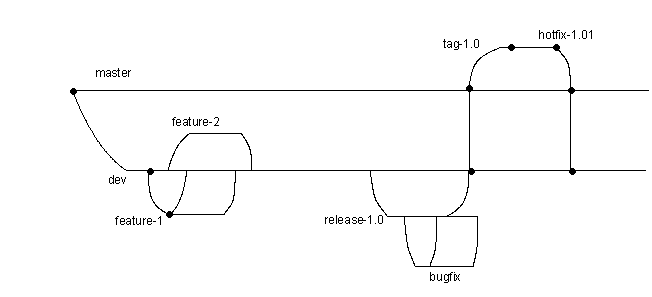
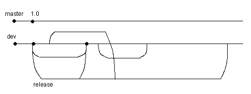

# iOS-Dev. 08.

## Git. GitFlow. Процесс разработки

__GitFlow__:



develop

master

release/9.0.0

feature/cherushnikov/DBIOSP-100 - расширенный нейминг веток

В сообщение коммита обязательно вкладывайте таск - DBIOSP-100


Ограничение на командную работу: фича, которую реализует команда - это не вся история, включающая всю разработку от бизнес-логики, сети и UI, а единственный коммит. Ветка `feature/****` - это один коммит. Этот единственный коммит ты через пулл-реквест вливаешь в дев.

Это сделано из принципа Agile. У вас есть __backlog__ задач на конкретную одну фичу. __Grooming__ задачи. 

__Commit squash__

---

__Trunk-based__ - другой способ, отличный от gitflow.



---

```
              release                              release
             --------------                       --------   
            /              \                     /        \
dev        /                \                   /          \ HEAD
---------------------------------          -----------------*-------------------
      \                                                      \             /
	   \                                                      \           /
	    -------------------------                              -----------
      feature                                                         feature
```

--> rebase

Sourcetree (программа с GUI для git).

---

## Зависимости, статические и динамические библиотеки

Есть запуск приложения, инициализация процесса, создание виртуального адресного пространства. В этом есть несколько этапов. 

У функции `main` есть такие понятия как pre-main и post-main. Приложение начинается с инициализации `main`'a, создается экземпляр `UIApplication`, `NSRunLoop`, создается глобальный autorelease pool, вместе с `UIApplication` создается главный `UIWindow`. Его можно задать "вручную" в методе класса `AppDelegate`.

Фаза __pre-main__. У нас есть код, который скомпилирован. И ещё у нас есть стандартный SDK, который поставляется с операционной системой - это `UIKit`, `Foundation` и другие используемые библиотеки. Суть в том, что их мы не тащим с собой в коде приложения. Дальше есть понятия __статическая библиотека__ и __динамическая библиотека__. 

Статическая библиотека на этапе компиляции добавляется в код приложения. Получается общий бинарник -- толстый, жирный, под все архитектуры. А количество архитектур начиная с iOS 9, всего 4. 

* ARM V7
* arm64
* 2 архитектуры симулятора: i386, x86_64.

Когда вы распространяете библиотеки, например, через GitHub, если Вы их поставляете бинарями, то это так называемые __*fat binaries*__ - бинарь со всеми архитектурами. Так вот статическая библиотека весь код со всеми архитектурами фактически добавляет в общий код и получается общий жирный бинарь. Это негативно сказывается на размере приложения.

Для уменьшения размера есть понятие динамической библиотеки. Бинарники под все архитектуры в момент выкладки приложения в App Store нарезаются и создаются отдельные версии для каждой архитектуры. Для iPhone 6 Вы скачаете только 64-битную архитектуру arm64. Но динамическая библиотека аффектит время холодного старта (когда нажимаем на иконку приложения). В этом её цена. При запуске процесса происходит загрузка этих библиотек в адресное пространство, выравнивание их адресов с вашим кодом, и это влияет на старт приложения. И это время называется __pre-main__'ом.

Распространяемый бандл приложения представляет собой архив ресурсов. Есть основной бинарник, есть картинки, XML'ки, и есть набор динамических библиотек, которые ты с собой тащишь. Это тоже набор бинарей и их заголовков. 

Динамические библиотеки - это то, что называется __*Frameworks*__ в XCode. Время первого показа экрана приложения очень зависит от количества и размера этих динамических библиотек.

---

Почему большие компании так неохотно переходят на Swift? Потому что у него нет application binary interface, то есть обратной совместимости на уровне бинарника приложения. Поэтому при выгрузке приложения на Swift вместе с ним идут ещё несколько системных библиотек свифта. То есть они не поставляются внутри самого iOS как UIKit для ObjC, они добавляются на этапе сборки архива приложения в App Store внутрь бандла в список фреймворков. И это тоже влияет на холодный старт. И также на размер приложения.

И проблема в том, что код на Swift 2 не может работать вместе с кодом на Swift 4.

Также есть lazy loading динамических библиотек по необходимости, но этот способ работает ещё медленнее.

Идеальный вариант для производительности -- это статическая библиотека. Тогда все биндинги и выравнивания уже сделаны на этапе компиляции. Применяйте их, если нет проблем с размером приложухи.

---


## Средства управления зависимостями: CocoaPods, Carthage, SPM

Можно писать какие-то вещи самим, но иногда дешевле использовать готовые решения.

### CocoaPods dependency manager

1) Установить

Установить `Alamofire` (добавить строку с github в pod-файл)


---

Библиотека мб 

* динамическая, 
* статическая
* или просто бандл с ресурсами.
* mac o type - позволяет собирать код с различными расширениями.

Самое важное - статические и динамические библиотеки. В чём отличие?

---

SPM - Swift Package Manager. Работает только со Swift кодом, с Obj-C не умеет. В СБОЛе не используется.

---

dyld - расширение динамической библиотеки.

```
                         architectures: (чтобы можно было запускать и на симуляторах, и девайсах)
         ------------      x86-64
        | Alamofire  | --- arm64
       / ------------          ------
      /     |                 | dsym |
     /      |-----             ------
 -----    ------  \  --------
| Ser |  | Host |  \| Kernel |
 -----   | App  |--\|--------|
          ------    |--------|
		            |--------|
				     --------
```

Host Application - это наше таргет-приложение, для которого мы задаем иконку.

Alamofire поставляется в виде динамической библиотеки. В ней лежат хедеры интерфейсные, и бинарник, скомпилированный под все архитектуры.

dsym - в бинаре лежат объектные символы - это промежуточный байткод для выполнения на LVVM-машине. Он в виде нечитаемом. Этот dsym нужен, чтобы в процессе отладки пром-сборки можно было прочитать краш, где стектрейс.

При нажатии на иконку приложения создается процесс. Есть pre-main история, в которой происходит инициализация этого процесса.

Первым в адресное пространство процесса загружается бинарник самого приложения. Потом загрузка динамической библиотеки. Её загрузка серьезно аффектит время холодного старта приложения.

Есть статический линковщик и динамический линковщик.

Аламофайр сможно слинковать как статическую либу. Тогда она будет в бинарнике самого приложения.

```
 -------------------      -----------------
| ImageLoader v.1.5 |    | Alamofire v.1.0 |
 -------------------      -----------------
                   \        ⬇
                     \    ----------
				       ->| Host app |
						  ----------
```

Менеджер пакетов не просто скачивает зависимости. Пусть ImageLoader тащит Alamofire v.1.5. Менеджер зависимости может слинковать так, чтобы использовалась последняя версия. Если что-то сломается, можно переписать весь код под последнюю версию. 

XCode Build билдит всё это под каждую архитектуру, потом слепляет все эти архитектуры в общий бинарник. Получается fat binary. Складывает это в директорию `builds`, потом мы вручную берем фреймворки и выстраиваем пути поиска в Host Application. 

CocoaPods делает примерно то же самое, но перехерачивает весь workspace (это не очень хорошо). В Проекте есть несколько абстракций. Можно работать с обычным проектом - `.xproject` файл, а есть более высокоуровневая абстракция Workspace, которая может включать несколько `.xproject`'ов. Каждый проект может иметь несколько таргетов, каждый таргет может быть своей библиотекой. 

Посмотрим, что такое CocoaPods и Carthage на практике в проекте с таблицей. Потом обсудим, что такое Sberthage - нужен для того, чтобы мультирепа подтягивалась и создавалось общее окружение.

---

### Carthage

Написан на Swift, работает со Swift и Obj-C. Разруливает конфликты и граф зависимостей, но имеет особенность, что 

у него есть 

* директория `checkouts`, в которую он затягивает исходный код, 
* директория `build`, в которой собираются fat binaries файлы библиотек.

Установить Carthage (через brew).

Создать cartfile (руками).

```
carthage update // поехала жара, клонирует репозитории и билдит под fat binaries.
carthage update --platform iOS // билд не под все, а конкретные платформы
```

`file` - команда, с помощью которой можно проверить, статическая это или динамическая библиотека. 

Чтобы использовать библиотеку, нужно зайти в Target:

Build Phases --> Link Binary with Libraries

и явно её прилинковать. Кроме линковки либы, надо скопировать её, иначе будет ошибка. + --> add Copy file phase --> destination, frameworks -> скопировали. Изи!

После этого её можно заимпортить.

---

Пример билда аламофаера как статической библиотеки и добавления его.

---

В СБОЛ: "Меч короля Артура"

```
              --------
             |        | st
			  --------
			     |
			  --------
             |        | st
			  --------
                 |
			  --------
             |        | st
			  --------
                 ⬇
			  ------------
             | middleware | dyld - каскадно слинковываются либы со старым кодом + Core либы. Они static.
			  ------------
             /      |         \
      ---------    ---------     ---------
dyld | Feature |  | Feature |   | Feature |
      ---------    ---------     ---------

                ----------
               | HOST APP |
				----------
```