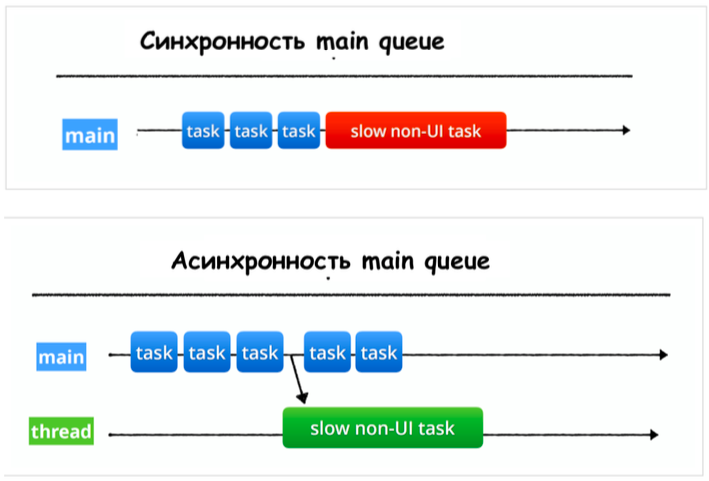

# iOS-Dev. GCD - Grand Central Dispatch.

Когда люди говорят, что знакомы с многопоточностью в iOS, они в основном аппелируют к __GCD__ - __Grand Central Dispatch__.

* Механизм распаралеливания задач 
* Доступно с iOS 4
* Не надо создавать потоки самостоятельно
* Вместо потоков очереди, которые быстрее работают (Очереди — это обычные очереди, в которые выстраиваются люди, чтобы купить, например, билет в кинотеатр. Система просто выполняет их согласно очереди, “выдергивая” следующего по очереди и запуская его на выполнение в соответствующем этой очереди потоке. Очереди следуют паттерну FIFO, это означает, что тот, кто первым был поставлен в очередь, будет первым направлен на выполнение. У вас может быть множество очередей и система “выдергивает” замыкания по одному из каждой очереди и запускает их на выполнение в их собственных потоках. Таким образом, вы получаете многопоточность.)

## Main Queue

* Последовательная
* Такая очередь одна на всё приложение



## Sync vs Async

* `dispatch_async` возвращает управление сразу же после вызова
* `dispatch_sync` ждёт выполнения блока и возвращает управление только после его выполнения
* С `dispatch_sync` нужно быть осторожнее

## Приоритеты очередей

```objectivec
#define DISPATCH_QUEUE_PRIORITY_HIGH 2
#define DISPATCH_QUEUE_PRIORITY_DEFAULT 0
#define DISPATCH_QUEUE_PRIORITY_LOW (-2)
#define DISPATCH_QUEUE_PRIORITY_BACKGROUND INT16_MIN
```

## Примеры

```objectivec
dispatch_async(dispatch_get_global_queue(DISPATCH_QUEUE_PRIORITY_DEFAULT, 0), ^{
    // Код, который должен выполниться в фоне.
});


dispatch_async(dispatch_get_global_queue(DISPATCH_QUEUE_PRIORITY_DEFAULT, 0), ^{
    // Код, который должен выполниться в фоне.

    dispatch_async(dispatch_get_main_queue(), ^{
        // Код, который выполнится в главном потоке.
    });
});


dispatch_async(dispatch_get_global_queue(DISPATCH_QUEUE_PRIORITY_DEFAULT, 0), ^{
    // Код, который должен выполниться в фоне.

    dispatch_sync(dispatch_get_main_queue(), ^{
        // Код, который нужно выполнить в главном потоке.
        // Мы ждем, пока он выполнится.
    });

    // Продолжаем работать в фоновом потоке.
});
```

```objectivec
+ (instancetype)sharedInstance
{
    static dispatch_once_t once;
    static id sharedInstance;
    dispatch_once(&once, ^{
        sharedInstance = [[self alloc] init];
    });
    return sharedInstance;
}
```

По сути передача блока на Main Queue равносильна вызову `NSObject#performSelectorOnMainThread`.

Приоритет очереди можно изменить (функция `dispatch_set_target_queue`).

В серийной очереди по сути есть ровно один поток, в котором она отрабатывает код блоков.

В конкурентной очереди может создавать несколько потоков, по которым будут распределяться задачи. Здесь возможно возникновение race conditions.

## Барьерные операции

Барьерные операции ставят барьер между операциями, поступившими "до" и "после". Таким образом, операции записи/изменения данных производятся последовательно (в отличие от операций чтения).

```swift
itemsQueue.async(flags: [.barrier]) { [weak self] in
  guard let self = self else { return }
  self._items = items.reduce(into: [:]) { res, item in
    res[item.id] = item
  }
  completion()
}
```

